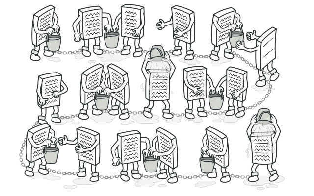
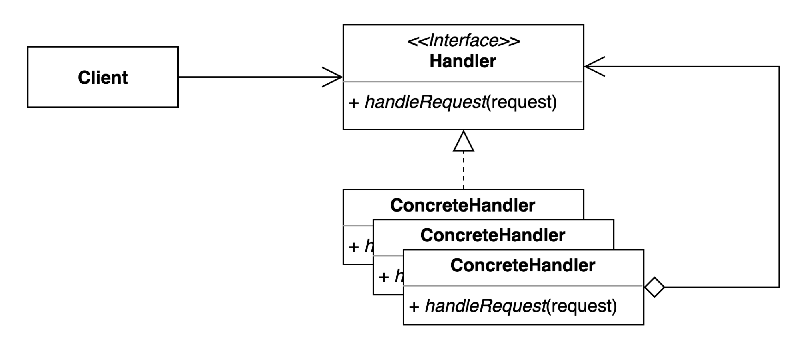

### [🏠 Main으로 돌아가기](../../README.md)

## Chain of Responsibility Pattern

### 개념

- 객체들이 연결된 체인 형태로 존재하며, 각 객체가 요청을 처리하지 못할 경우, 다음 객체에게 책임을 전달하고, 다음 객체 또한 처리하지 못하면 다시 다음 객체로 전달하는 패턴

- 객체 간의 결합도를 낮추고, 요청을 처리할 객체를 동적으로 결정하는 데 유용함

  - 요청 처리 과정에서 요청을 처리할 객체를 직접 지정하지 않아도 되므로, 클라이언트 코드와 서버 코드 간의 결합도가 낮아짐

- 예를 들어 로그인 처리나 예외 처리와 같은 경우에 유용하게 사용될 수 있음

- 요청 처리 과정에서 각 객체가 책임을 나누어 처리할 수 있으므로, 코드 유지 보수성과 확장성을 높일 수 있음

### 패턴 구조

- `Handler`

  - 요청을 수신하고 처리 객체들의 집합을 정의하는 인터페이스

- `ConcreteHandler`

  - 요청을 처리하는 실제 처리 객체

  - 핸들러에 대한 필드를 내부에 가지고 있으며, 메서드를 통해 다음 핸들러를 체인시키고 다음 체인의 핸들러를 바라봄

  - 자신이 처리할 수 없는 요구가 나오면, 바라보고 있는 다음 체인의 핸들러에게 요청을 떠넘김

  - `ConcreteHandler_1` - `ConcreteHandler_2` - `ConcreteHandler_3` - ... 이와 같은 방식으로 체인 형식이 구성됨

- `Client`

  - 요청을 핸들러에게 전달
