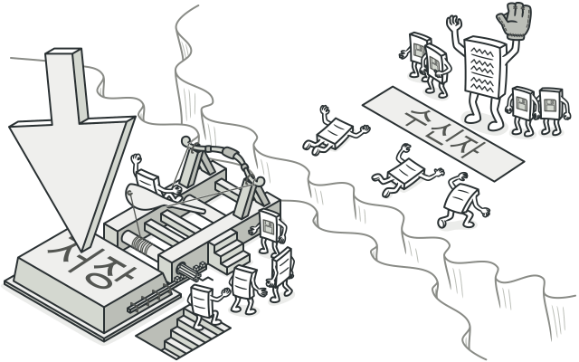
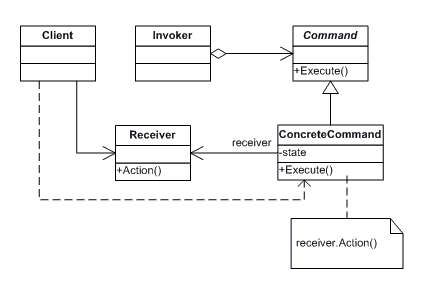

### [↩︎ Main으로 돌아가기](../../README.md)

## Iterator Pattern

### 개념

- 실행될 기능을 캡슐화함으로써, 주어진 여러 기능을 실행할 수 있는 재사용성이 높은 클래스를 설계하는 패턴

- 하나의 추상 클래스에 메서드를 만들어 각 명령이 들어오면 그에 맞는 서브 클래스가 선택되는 특징을 갖고 있음

- 커맨드 패턴을 사용하면 어떤 객체(A)에서 다른 객체(B)의 메서드를 실행하려고 할 때 의존성을 제거할 수 있음

  - 또한 기능이 수정되거나 변경이 일어날 때 A 클래스의 코드를 수정할 필요 없이 기능에 대한 클래스를 정의하면 되므로 시스템이 확장성이 있으면서 유연성을 가질 수 있음

### 패턴 구조

- `Command`

  - 실행될 기능에 대한 인터페이스

    - 실행될 기능을 `execute` 메서드로 선언

- `ConcreteCommand`

  - 실제로 실행되는 기능을 구현

    - `Command` 인터페이스를 구현

- `Invoker`

  - 기능의 실행을 요청하는 호출자 클래스

    - `Command` 객체를 캡슐화하며 요청을 처리하기 위해 커맨드 객체에 요청을 전달

- `Receiver`

  - `ConcreteCommand`에서 `execute` 메서드를 구현할 때 필요한 클래스

    - `ConcreteCommand`의 기능을 실행하기 위해 사용하는 수신자 클래스
