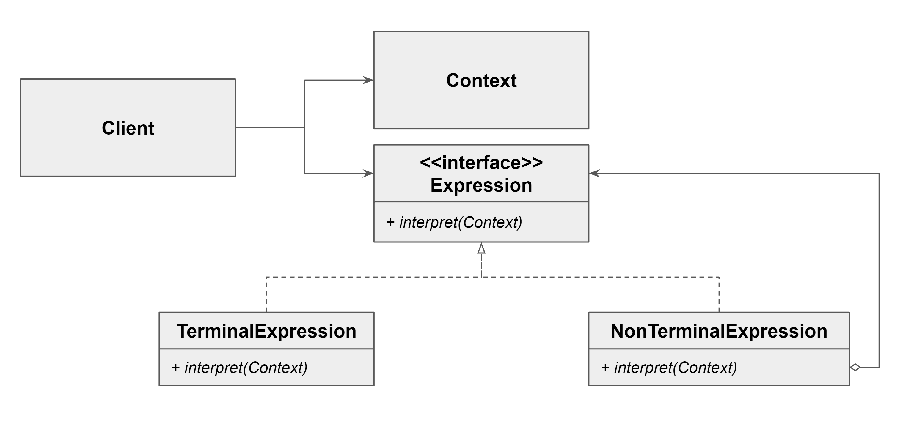

### [↩︎ Main으로 돌아가기](../../README.md)

## Interpreter Pattern

### 개념

- 인터프리터의 의미 자체는 보통 해석해주거나 통역해주는 역할을 가진 사람 혹은 물건을 의미

  - 악보를 음악으로 변환하는 것도 이러한 역할의 하나이기 때문에 연주자라는 의미도 있음

- 가장 쉽게 볼 수 있는 예로는 정규표현식이 있음

- 자주 등장하는 문제를 별개의 언어로 정의하고 재사용하는 패턴

  - 문법에 등장하는 규칙을 클래스로 표현하고 언어에서의 표현식을 해석하고 평가

  - `Expression`이라는 추상 클래스를 만드는 경우가 많음

  - `Expression` 클래스에서 파생된 구체적인 클래스는 언어의 다양한 규칙 또는 요소를 나타냄

- 반복되는 문제 패턴을 언어 또는 문법으로 정의하고 확장할 수 있음

### 패턴 구조

- `interpret`

  - 항상 `Context`가 있음이 중요

- `TerminalExpression`

  - 종료가 가능한 `Expression`

  - 숫자 연산을 예시로 들면, 숫자 그 자체

  - AST에서 트리의 leaf node로 표현될 수 있는 것

- `NonTerminalExpression`

  - 다른 `Expression`을 참조하는 `Expression`

  - 숫자 연산을 예시로 들면, 연산을 할 때의 연산 기호

  - 그 자체로 끝날 수 없음
