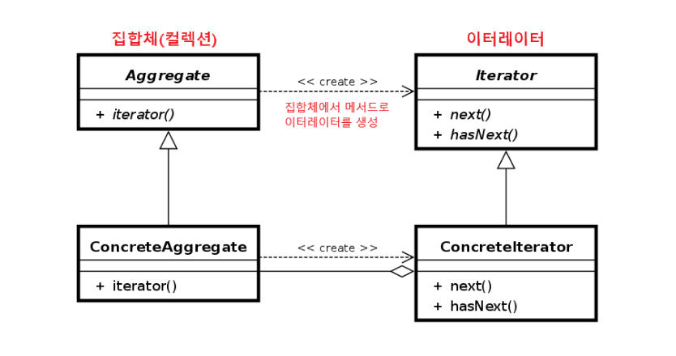

### [↩︎ Main으로 돌아가기](../../README.md)

## Iterator Pattern

### 개념

- 일련의 데이터 집합에 대하여 순차적인 접근(순회)를 지원하는 패턴

  - 데이터 집합이단, 객체들을 그룹으로 묶어 자료의 구조를 취하는 컬렉션을 말하며, 대표적인 컬렉션으로 리스트, 트리, 그래프, 테이블 등이 있음

- 보통 배열이나 리스트 같은 경우, 순서가 연속적인 데이터 집합이기 때문에 간단한 for문을 통해 순회할 수 있지만, 해시, 트리와 같은 컬렉션은 데이터 저장 순서가 정해지지 않고 적재되기 때문에 각 요소들을 어떤 기준으로 접근해야 할지 애매함

- 복잡하게 얽혀있는 자료 컬렉션들을 순회하는 알고리즘 전략을 정의하는 것을 반복자(Iterator) 패턴이라고 함

- 컬렉션 객체 안에 들어있는 모든 원소들에 대한 접근 방식이 공통화 되어 있다면 어떤 종류의 컬렉션에서도 이터레이터만 뽑아내면 여러 전략으로 순회가 가능하기 때문에, 보다 다형적인 코드를 설계할 수 있음

### 패턴 이미지

  

- `Iterator` (반복자)

  - 요소를 순서대로 검색하는 인터페이스를 결정 (`hasNext`, `next`)

- `ConcreteIterator` (구체적인 반복자)

  - `Iterator`가 결정한 인터페이스를 구현하는 부분, 검색하기 위해 필요한 정보를 가지고 있어야 함

- `Aggregate` (집합체)

  - `Iterator` 역할을 만드는 인터페이스를 결정

- `ConcreteAggregate` (구체적인 집합체)
  - `Aggregate` 역할이 결정한 인터페이스를 실제로 구현
