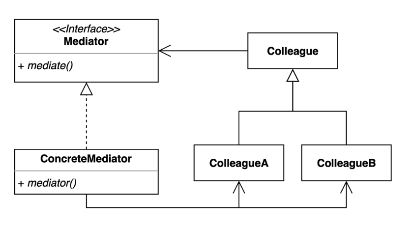

### [↩︎ Main으로 돌아가기](../../README.md)

## Mediator Pattern

### 개념

- 여러 객체 간의 의사소통하는 방법을 추상화

- 객체 간의 혼란스러운 종속성을 줄일 수 있는 디자인 패턴

- 객체 간, 직접적인 통신을 제한하고 중재자 객체(Mediator Object)를 통해서만 협업하도록 제한

- 실생활의 예제

  - 주민들 간의 갈등을 중간에서 해결해주는 아파트 관리사무소

  - 비행기 이착륙을 돕는 관제탑

### 패턴 이미지

  

- 해당 형태의 다이어그램 만이 중재자 패턴인 것이 아닌, 해당 형태의 다이어그램이 대표적인 중재자 패턴인 것

  - 즉, 다른 다이어그램으로 그려져도 중재자 패턴을 사용한 것일 수 있음

- `Colleague` 간의 직접적인 참조 선이 없는 것이 중요 포인트

  - `Mediator`를 참조하고, `ConcreteMediator`가 각 `ColleagueA`, `ColleagueB`를 참조

- 의존성을 중재자인 `Mediator`로 몰아 놓음
