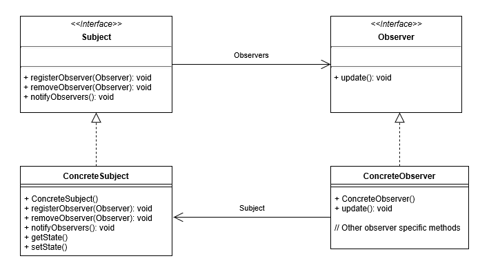

### [🏠 Main으로 돌아가기](../../README.md)

## Observer Pattern

### 개념

- 어떤 이벤트가 일어나는 것을 감시하는 패턴을 의미

- 함수로 직접 요청한 적 없지만 시스템에 의해 발생하는 동작들을 이벤트라고 하는데, 이러한 이벤트들을 감시하여 이벤트가 발생할 때마다 미리 정의해 둔 어떠한 동작을 즉각 수행하게 해주는 프로그래밍 패턴

- 옵저버 패턴을 활용하면 다른 객체의 상태 변화를 별도의 함수 호출 없이 즉각적으로 알 수 있기 때문에, 이벤트에 대한 처리를 자주 해야 하는 프로그램이라면 매우 효율적인 프로그램을 작성할 수 있음

- 여타 다른 디자인 패턴들과 다르게 <b><u>일대다(`one-to-many`) 의존성</u></b>을 가지는데, 주로 분산 이벤틈 핸들링 시스템 구현을 하는데 사용함

  - `Pub/Sub` 모델로도 알려져 있음

### 패턴 구조

- `Subject`

  - 관찰 대상자를 정의하는 인터페이스

- `ConcreteSubject`

  - 관찰 당하는 대상자 / 발행자 / 게시자

  - <b><u>`Observer`들을 리스트(`List`, `Map`, `Set` 등...)로 모아 합성(`composition`)</u></b>하여 가지고 있음

  - `Subject`의 역할은 관찰자인 `Observer`들을 내부 리스트에 등록/삭제하는 인프라를 갖고 있음 (`register`, `remove`)

  - `Subject`가 상태를 변경하거나 어떤 동작을 실행할 때, `Observer`들에게 이벤트 알림(`notify`)을 발행

- `Observer`

  - 구독자들을 묶는 인터페이스 (다형성)

- `ConcreteObserver`

  - 관찰자 / 구독자 / 알림 수신자

  - `Observer`들은 `Subject`가 발행한 알림에 대해 현재 상태를 취득

  - `Subject`의 업데이트에 대해 전후 정보를 처리
