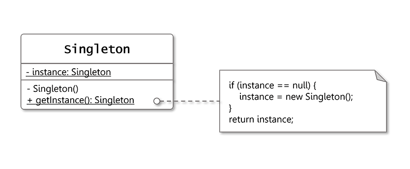
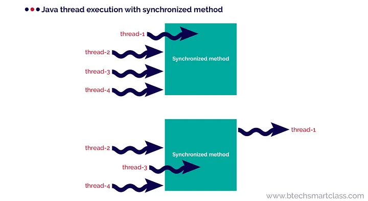
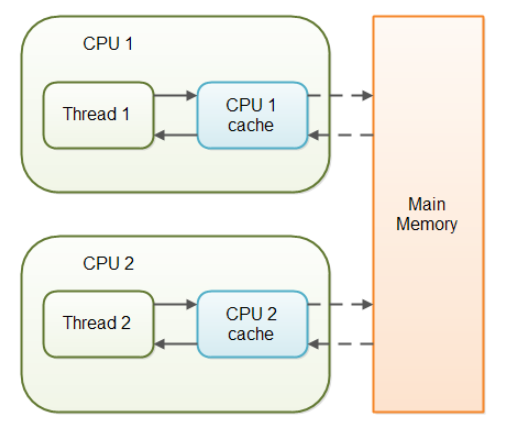

### [↩︎ Main으로 돌아가기](../../README.md)

## Singleton Pattern


### 개념

- <b><u>단 하나의 유일한 객체를 만들기 위한</u></b> 코드 패턴

  - 쉽게 말하자면, <b><u>메모리 절약</u></b>을 위해 인스턴스가 필요할 때 똑같은 인스턴스를 <b><u>새로 만들지 않고 기존의 인스턴스를 가져와 활용</u></b>하는 기법

- 코드를 짤 때 전역 변수를 만들어 이용하는 이유와 개념을 그대로 클래스에 대입한 것이 싱글턴 패턴

- 따라서 해당 패턴이 적용된 객체가 필요한 경우는 그 객체가 <b><u>리소스를 많이 차지하는 역할을 하는 무거운 클래스</u></b>일 때 적합

- 대표적인 활용 예시

  - 데이터베이스 연결 모듈

  - 디스크 연결

  - 네트워크 통신

  - DBCP 커넥션풀

  - 스레드풀

  - 캐시

  - 로그 기록 객체 등

### 패턴 구조



- 싱글턴으로 이용할 클래스를 외부에서 마구잡이로 `new` 생성자를 통해 인스턴스와하는 것을 제한하기 위해 <b><u>클래스 생성자 메서드에 `private` 키워드를 붙여주면 됨</u></b>

### 패턴 구현 기법 종류

#### `Eager Initialization`

- 한 번만 미리 만들어두는, 가장 직관적이면서도 심플한 기법

- `Java`의 경우, `static final`이라 멀티 스레드 환경에서도 안전함

  > `static final`
  >
  > - `Java` 환경에서의 상수 선언
  >
  > - 해당 값은 객체마다 저장될 필요가 없으며(`static`의 성질) + 여러 값을 가질 수 없음(`final`의 특징)

- `static` 멤버는 당장 객체를 사용하지 않더라도 메모리에 적재하기 때문에 만일 리소스가 큰 객체일 경우, <b><u>공간 자원 낭비</u></b>가 발생함

- 예외 처리 불가능

> 만일 싱글턴을 적용한 객체가 그리 크지 않은 객체라면 이 기법으로 적용해도 무리 X

<details>
  <summary>singleton_eager.ts</summary>

```TS
  class SingletonEager {
    // 싱글턴 클래스 객체를 담을 인스턴스 변수
    private static INSTANCE: SingletonEager = new SingletonEager();

    // 생성자를 private로 선언 (외부에서 new 사용 X)
    private constructor() {}
    // private SingletonEager() {} -> Java

    public static getInstance(): SingletonEager {
      return SingletonEager.INSTANCE;
    }
  }

  SingletonEager.getInstance();
```

</details>

#### `Static Block Initialization`

> `static block`
>
> - 클래스가 로딩되고 클래스 변수가 준비된 후 자동으로 실행되는 블록

- `static block`을 이용하여 예외를 잡을 수 있음

- 여전히 `static`의 특정으로 사용하지 않아도 공간을 차지함

<details>
  <summary>singleton_static_block.ts</summary>

```TS
  class SingletonStaticBlock {
    // 싱글턴 클래스 객체를 담을 인스턴스 변수
    private static instance: SingletonStaticBlock;

    // 생성자를 private로 선언 (외부에서 new 사용 X)
    private constructor() {}
    // private SingletonStaticBlock() {} -> Java

    // static 블록을 이용해 예외 처리
    static {
      try {
        this.instance = new SingletonStaticBlock();
      } catch (error) {
        throw console.log("싱클턴 객체 생성 오류", error);
      }
    }

    public static getInstance(): SingletonStaticBlock {
      return this.instance;
    }
  }

  SingletonStaticBlock.getInstance();
```

</details>

#### `Lazy Initialization`

> 스레드 개념 이해를 위해 Java 코드로 예제 작성

- 객체 생성에 대한 관리를 내부적으로 처리

- 메서드를 호출했을 때 인스턴스 변수의 `null` 유무에 따라 초기화하거나 있는 걸 반환하는 기법

- 위의 미사용 고정 메모리 차지의 한계점을 극복

- <b><u>그러나 스레드 세이프(`Thread Safe`)하지 않는 치명적인 단점을 가지고 있음</u></b>

<details>
  <summary>singleton_lazy/Main.java</summary>

```JAVA
  class SingletonLazy {
      private static SingletonLazy instance;

      private SingletonLazy() {}

      public static SingletonLazy getInstance() {
          if (instance == null) {
              instance = new SingletonLazy(); // 오직 1개의 객체만 생성
          }

          return instance;
      }
  }
```

</details>

- ❗️ 멀티 스레드 환경에서의 치명적인 문제점

  > 대부분의 자료에서 보통 위의 코드를 싱글턴 패턴의 정석이라고 하지만,
  >
  > 사실 이는 치명적인 문제점을 가지고 있다.

  - Java는 멀티 스레드 언어인데, 이 멀티 스레드 환경에서 스레드 세이프하지 않다는 것

  - 각 스레드는 자신의 실행 단위를 기억하면서 코드를 위에서 아래로 읽어가기에,
    다음과 같은 동시성으로 인한 코드 실행 문제점이 발생할 수 있게 됨

    1. 스레드 <span style="color: red; font-weight: bold;">A</span>, 스레드 <span style="color: blue; font-weight: bold;">B</span>가 존재

    2. 스레드 <span style="color: red; font-weight: bold;">A</span>가 if문을 평가하고 인스턴스 생성 코드로 진입 (아직 초기화 진행 X)

    3. 그런데 그때, 스레드 <span style="color: blue; font-weight: bold;">B</span>가 if문을 평가하게 되고, 아직 스레드<span style="color: red; font-weight: bold;">A</span>가 인스턴스화 코드를 실행시키지 않았기 때문에 이 if문도 `true`가 됨

    4. 결과적으로 스레드 <span style="color: red; font-weight: bold;">A</span>와 스레드 <span style="color: blue; font-weight: bold;">B</span>가 인스턴스 초기화 코드를 두 번 실행하는 꼴이 됨 (원자성이 결여)

    <details>
      <summary>singleton_lazy/Main.java</summary>

    ```JAVA
      package singleton_lazy;
      import java.util.concurrent.ExecutorService;
      import java.util.concurrent.Executors;

      // 싱글턴 객체
      class SingletonLazy {
          private static SingletonLazy instance;

          private SingletonLazy() {}

          public static SingletonLazy getInstance() {
              if (instance == null) {
                  instance = new SingletonLazy(); // 오직 1개의 객체만 생성
              }

              return instance;
          }
      }

      public class Main {
          public static void main(String[] args) {
              // 1. 싱글턴 객체를 담을 배열
              SingletonLazy[] singleton = new SingletonLazy[10];

              // 2. 스레드 풀 생성
              ExecutorService service = Executors.newCachedThreadPool();

              // 3. 반복문을 통해 10개의 스레드가 동시에 인스턴스 생성
              for (int i = 0; i < 10; i++) {
                  final int num = i;
                  service.submit(() -> {
                      singleton[num] = SingletonLazy.getInstance();
                  });
              }

              // 4. 종료
              service.shutdown();

              // 5. 싱글턴 객체 주소 출력
              for(SingletonLazy s : singleton) {
                  System.out.println(s.toString());
              }
          }
      }

      // singleton_lazy.SingletonLazy@7f31245a
      // singleton_lazy.SingletonLazy@6d6f6e28
      // ---------------------------------------> 싱글턴 클래스인데 객체 두 개가 만들어짐
      // singleton_lazy.SingletonLazy@6d6f6e28
      // singleton_lazy.SingletonLazy@6d6f6e28
      // singleton_lazy.SingletonLazy@6d6f6e28
      // singleton_lazy.SingletonLazy@6d6f6e28
      // singleton_lazy.SingletonLazy@6d6f6e28
      // singleton_lazy.SingletonLazy@6d6f6e28
      // singleton_lazy.SingletonLazy@6d6f6e28
      // singleton_lazy.SingletonLazy@6d6f6e28
    ```

    </details>

#### `Thread safe Initialization`

> `synchronized` 개념 이해를 위해 Java 코드로 예제 작성

- `synchronized` 키워드를 통해 메서드에 스레드들을 하나하나씩 접근하게 하도록 설정 (동기화)

- 하지만 여러 개의 모듈들이 매번 객체를 가져올 때, `synchronized` 메서드를 매번 호출하여 동기화 처리 작업에 `overhead`가 발생하여 <b><u>성능 하락</u></>이 발생

> `synchronized`
>
> - 멀티 스레드 환경에서 두 개 이상의 스레드가 하나의 변수에 동시에 접근할 때 `Race condition`(경쟁상태)이 발생하지 않도록 함
>
> - 한 마디로 스레드가 해당 메서드를 실행하는 동안 다른 스레드가 접근하지 못하도록 잠금(lock)을 거는 것으로 보면 됨
>
> 
>
> 1. `thread-1`이 메서드에 진입하는 순간
>
> 2. 나머지 `thread-2 ~ 4`의 접근을 제한하고,
>
> 3. `thread-1`이 완료가 되면 다음 스레드를 접근시킴

<details>
  <summary>singleton_thread_safe/Main.java</summary>

```JAVA
  package singleton_thread_safe;

  class SingletonThreadSafe {
    private static SingletonThreadSafe instance;

    private SingletonThreadSafe() {}

    // synchronized 메서드
    public static synchronized SingletonThreadSafe getInstance() {
      if (instance == null) {
        instance = new SingletonThreadSafe();
      }

      return instance;
    }
  }
```

</details>

#### Double-Checked Locking

> `volatile` 개념 이해를 위해 Java 코드로 예제 작성

- 매번 `synchronized` 동기화를 실행하는 것이 문제라면, 최초 초기화할 때만 적용하고 이미 만들어진 인스턴스를 반환할 때는 사용하지 않도록 하는 기법

- 이때 인스턴스 필드에 `volatile` 키워드를 붙여주어야 I/O 불일치 문제를 해결할 수 있음

- 그러나 `volatile` 키워드를 사용하기 위한 조건으로 `JVM` 버전이 1.5 이상이어야 하며, `JVM`에 대한 심층적인 이해가 필요함

  - <b><u>`JVM`에 따라서 여전히 스레드 세이프 하지 않는 경우가 발생하기 때문에 사용하기를 지양하는 편</u></b>

> `volatile`
>
> `Java`에서는 스레드를 여러 개 사용할 경우, 성능을 위해서 각각의 스레드들은 변수를 메인 메모리(`RAM`)으로부터 가져오는 것이 아니라, 캐시(`Cache`) 메모리에서 가져오게 된다.
>
> 문제는 비동기로 변수 값을 개시에 저장하다가, 각 스레드마다 할당되어있는 캐시 메모리의 변수 값이 일치하지 않을 수 있다는 점이다.
>
> 그래서 `volatile` 키워드를 통해 이 변수는 캐시에서 읽지 말고 메인 메모리에서 읽어오도록 지정해주는 것이다.
>
> 

<details>
  <summary>singleton_thread_safe/Main.java</summary>

```JAVA
  package singleton_double_checked_locking;

  class SingletonDoubleCheckedLocking {
    private static volatile SingletonDoubleCheckedLocking instance; // volatile 키워드 적용

    private SingletonDoubleCheckedLocking() {}

    public static SingletonDoubleCheckedLocking getInstance() {
      if (instance == null) {
        // 메서드에 동기화를 거는 것이 아닌, Singleton 클래스 자체에 동기화를 걸어둠
        synchronized (SingletonDoubleCheckedLocking.class) {
          if (instance == null) {
            instance = new SingletonDoubleCheckedLocking();
            // 최초 초기화만 동기화 작업이 일어나서 리소스 낭비를 최소화
          }
        }
      }

      return instance; // 최초 초기화가 되면 앞으로 생성된 인스턴스만 반환
    }
  }
```

</details>

#### Bill Pugh Solution (LazyHolder)

> 스레드 관련 내용이기 때문에 Java 코드로 예제 작성

- 멀티 스레드 환경에서 안전하고 `Lazy Loading`(나중에 객체 생성)도 가능한 완벽한 싱글턴 기법

- 클래스 안에 내부 클래스(`holder`)를 두어 `JVM`의 클래스 로더 매커니즘과 클래스가 로드되는 시점을 이용한 방법 (스레드 세이프함)

- `static` 메소드에서는 `static` 멤버만을 호출할 수 있기 때문에 내부 클래스를 `static`으로 설정

  - 이 밖에도 내부 클래스의 치명적인 문제점인 메모리 누수 문제를 해결하기 위해 내부 클래스를 `static`으로 설정

- 다만, 클라이언트가 임의로 싱글턴을 파괴할 수 있다는 단점을 지님 (`Reflection API`, 직렬화/역직렬화를 통해)

<details>
  <summary>singleton_bill_pugh/Main.java</summary>

```JAVA
  package singleton_bill_pugh;

  class SingletonBillPugh {
    private SingletonBillPugh() {}

    private static class SingleInstanceHolder {
      private static final SingletonBillPugh INSTANCE = new SingletonBillPugh();
    }

    public static SingletonBillPugh getInstance() {
      return SingleInstanceHolder.INSTANCE;
    }
  }
```

1. 내부 클래스를 `static`으로 선언했기 때문에 싱글턴 클래스가 초기화되어도 `SingleInstanceHolder` 내부 클래스는 메모리에 로드되지 않음

2. 어떠한 모듈에서 `getInstance()` 메서드를 호출할 때, `SingleInstanceHolder` 내부 클래스의 `static` 멤버를 갖와 리턴하게 되는데, 이때 내부 클래스가 한 번만 초기화되면서 싱글턴 객체를 최초로 생성 및 리턴

3. 마지막으로 `final`로 지정함으로서 다시 값이 할당되지 않도록 방지

</details>

#### Enum 사용

- `enum`은 애초에 멤버를 만들 때, `private`로 만들고 한 번만 초기화하기 때문에 스레드 세이프함

- `enum` 내에서 상수 뿐만 아니라, 변수나 메서드를 선언해 사용이 가능하기 때문에, 이를 이용해 싱글턴 클래스처럼 응용이 가능

- 위의 [Bill Pugh Solution](#bill-pugh-solution-lazyholder) 기법과 달리, 클라이언트에서 `Reflection`을 통한 공격에도 안전

- 단점으로는 아래와 같음

  - 만일 싱글턴 클래스를 <b><u>일반적인 클래스로 마이그레이션을 해야할 때, 처음부터 코드를 다시 짜야함</u></b> (개발 스펙은 언제 어디서나 변경될 수 있기 때문)

  - <b><u>클래스 상속이 필요할 때, `enum` 외의 클래스 상속은 불가능</u></b>
