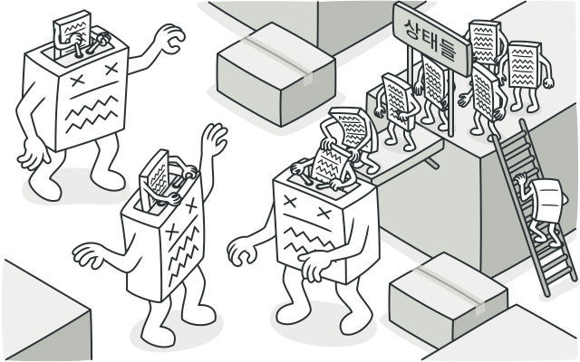
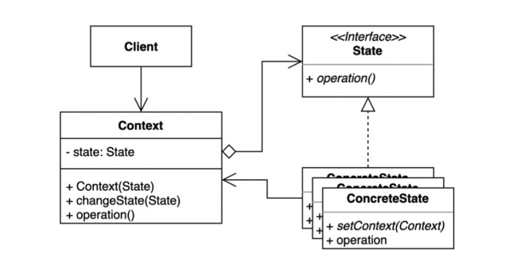

### [🏠 Main으로 돌아가기](../../README.md)

## State Pattern

### 개념

> 상태란? 객체가 가질 수 있는 어떤 조건이나 상황을 의미
>
> 상태 클래스는 싱글톤 클래스로 구성

- 객체가 특정 상태에 따라 행위를 달리하는 상황에서 상태를 조건문으로 검사해서 행위를 달리하는 것이 아닌, 상태를 객체화하여 상태가 행동을 할 수 있도록 위임하는 패턴

- 객체 지향 프로그래밍에서의 클래스는 꼭 사물/생물만을 표현하는 고체 형태의 데이터만 표현할 수 있는게 아닌, 경우에 따라서 무형태의 행위/동작도 클래스로 묶어 표현할 수 있음

  - 따라서 상태를 클래스로 표현하면 클래스를 교체해서 '상태의 변화'를 표현할 수 있고, 객체 내부 상태 변경에 따라 객체의 행동을 상태에 특화된 행동들로 분리해 낼 수 있으며, 새로운 행동을 추가하더라도 다른 행동에 영향을 주지 않음

### 패턴 구조

- `State` 인터페이스

  - 상태를 추상화한 고수준 모듈

- `ConcreteState`

  - 구체적인 각각의 상태를 클래스로 표현

  - `State` 역할로 결정되는 인터페이스(API)를 구체적으로 구현

  - 다음 상태가 결정되면 `Context`에 상태 변경을 요청하는 역할도 함

- `Context`

  - `State`를 이용하는 시스템

  - 시스템 상태를 나타내는 `State` 객체를 합성(composition)하여 가지고 있음

  - 클라이언트로부터 요청받으면 `State` 객체에 행위 실행을 위임
