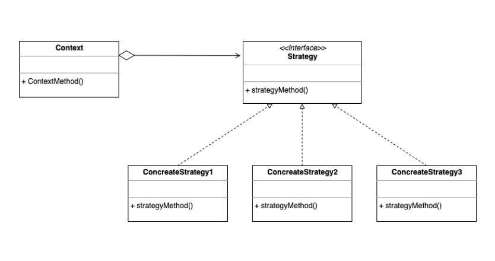

### [↩ Main으로 돌아가기](../../README.md)

## Strategy Pattern

### 개념

- 실행(런타일) 중에 알고리즘 전략을 선택하여 객체 동작을 실시간으로 바뀌도록 할 수 있게 하는 행위 디자인 패턴
- 여기서 '전략'이란 일종의 알고리즘이 될 수도 있으며, 기능이나 동작이 될 수도 있는 특정한 목표를 수행하기 위한 행동 계획을 말함

- 즉, 어떤 일을 수행하는 알고리즘이 여러가지일 때, 동작들을 미리 전략으로 정의함으로써 손쉽게 전략을 교체할 수 있는, <u>**알고리즘 변형이 빈번하게 필요한 경우**</u>에 적합한 패턴

### 패턴 이미지

  

- 전략 알고리즘 객체들

  - 알고리즘, 행위, 동작을 객체로 정의한 구현체

- 전략 인터페이스

  - 모든 전략 구현체에 대한 공용 인터페이스

- 컨텍스트 (`Context`)

  - 알고리즘을 실행해야 할 때마다 해당 알고리즘과 연결된 전략 객체의 메소드를 호출

- 클라이언트

  - 특정 전략 객체를 컨텍스트에 전달 함으로써 전략을 등록하거나 변경하여 전략 알고리즘을 실행한 결과를 누림
