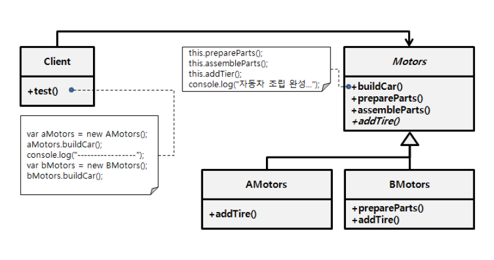

### [↩︎ Main으로 돌아가기](../../README.md)

## Template Method Pattern

### 개념

- 기초 클래스에서 알고리즘의 골격을 정의할 수 있도록 하는 행동 디자인 패턴

- 자식 클래스들이 전체 알고리즘의 구조를 변경하지 않고도 기본 알고리즘의 단계들을 오버라이드할 수 있도록 함

### 패턴 구조

  

- 자동차 회사에 대한 추상 클래스를 생성해서 공통으로 사용하는 `buildCar` 메서드를 정의

- 자동차 조립을 위한 부품을 준비하고 조립한 후, 타이어를 장착하는 것으로 완성

- 추상 클래스를 상속하며 `AMotors`, `BMotors` 클래스를 정의하고 `addTire` 매서드를 각각 구현하여 `buildCar` 메서드의 기능을 완성
