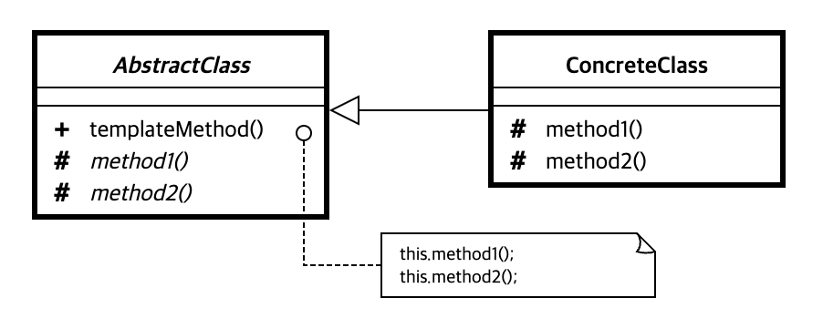

### [↩︎ Main으로 돌아가기](../../README.md)

## Template Method Pattern

### 개념

- <b><u>여러 클래스에서 공통으로 사용하는 메서드를 템플릿화</u></b>하여 상위 클래서에서 정의하고, <b><u>하위 클래스마다 세부 동작 사항을 다르게 구현</u></b>하는 패턴

  - 즉, <b><u>변하지 않는 기능(템플릿)은 상위 클래스에</u></b> 만들어두고, <b><u>자주 변경되며 확장할 기능은 하위 클래스에서</u></b> 만들도록 하여
    상위의 메소드 실행 동작 순서는 고정하면서, 세부 실행 내용은 다양화 될 수 있는 경우에 사용함

- 템플릿 메소드 패턴은 상속이라는 기술을 극대화하여, <b><u>알고리즘의 뼈대</u></b>를 맞추는 것에 초점을 둠

  - 이미 수많은 프레임워크에서 많은 부분에 템플릿 메소드 패턴 코드가 적용되어 있음

> 디자인 페턴에서의 템플릿은 변하지 않는다는 것을 의미

### 패턴 구조

- `AbstractClass` (추상 클래스)

  - 템플릿 메소드를 구현하고, 템플릿 메소드에서 돌아가는 추상 메소드를 선언함

  - 이 추상 메소드는 하위 클래스인 `ConcreteClass` 역할에 의해 구현됨

- `ConcreteClass` (구현 클래스)

  - `AbstractClass`를 상속하고, 추상 메소드를를 구체적으로 구현함

  - `ConcreteClass`에서 구현한 메소드는 `AbstractClass`의 템플릿 메소드에서 호출
