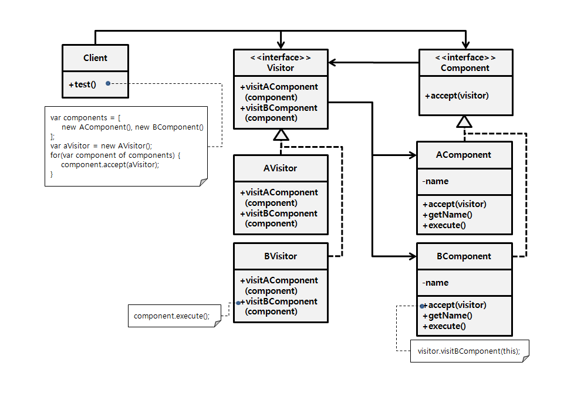

### [↩︎ Main으로 돌아가기](../../README.md)

## Visitor Pattern

### 개념

- 비지터 패턴이란 계층을 가진 클래스들에서 특정 알고리즘을 캡슐화하고 싶을 때 사용

  - 이를 통해서 여러 계층에서 쓰이는 알고리즘을 쉽게 전환하고 확장이 가능

  - 다소 복잡할 수 있지만, 사실 상태 패턴이나 전략 패턴에서 `Context`가 여러 계층으로 바뀐 것이라고 보면 쉬움

- 계층이 여러 개이기 때문에 `Strategy` 혹은 `State`에서 수행할 메소드가 계층의 모든 타입에 오버로딩되어야 하고, 오버로딩의 정적 바인딩 문제를 해결하기 위해서 계층별로 `accept` 함수를 생성

- 위의 과정으로 통해 `State`나 `Strategy`처럼 캡슐화된 부분은 유연해지나, `Context`의 확장이 어려운 편

- 기능들이 많아질수록 복잡해지며 적용 범위가 좁기 떄문에 매우 일반적인 패턴은 아니며, 사용에 있어서 인기도가 높지 않음

### 패턴 구조

