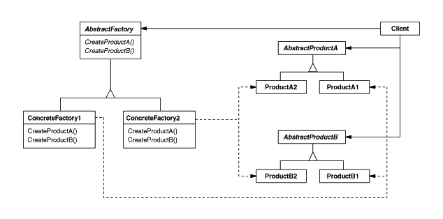

## Abstract Factory Pattern

### 개념

- 연관성있는 객체 군이 여러개 있을 경우 이들을 묶어 추상화하고, 어떤 구체적인 상황이 주어지면 팩토리 객체에서 집합으로 묶은 객체 군을 구현화하는 생성 패턴

- 클라이언트에서 특정 객체를 사용할 때 팩토리 클래스만을 참조하여 특정 객체에 대한 구현부를 감추어 역할과 구현을 분리시킬 수 있음

- 즉, 추상 팩토리 패턴의 핵심은 **제품 "군" 집합**을 타입 별로 찍어낼 수 있다는 점이 포인트

### 패턴 이미지

  

