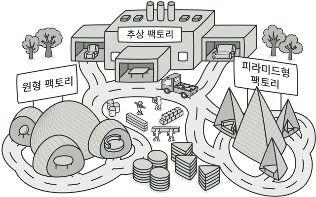

### [🏠 Main으로 돌아가기](../../README.md)

## Abstract Factory Pattern

### 개념

- 연관성있는 객체 군이 여러개 있을 경우 이들을 묶어 추상화하고, 어떤 구체적인 상황이 주어지면 팩토리 객체에서 집합으로 묶은 객체 군을 구현화하는 생성 패턴

- 클라이언트에서 특정 객체를 사용할 때 팩토리 클래스만을 참조하여 특정 객체에 대한 구현부를 감추어 역할과 구현을 분리시킬 수 있음

- 즉, 추상 팩토리 패턴의 핵심은 <b><u>제품 "군" 집합</u></b>을 타입 별로 찍어낼 수 있다는 점이 포인트

### 패턴 구조

- `AbstractFactory`

  - 최상위 공장 클래스

  - 여러 개의 제품들을 생성하는 여러 메소드들을 추상화함

- `ConcreteFactory`

  - 서브 공장 클래스들은 타입에 맞는 제품 객체를 반환하도록 메소드들을 재정의함

- `AbstractProduct`

  - 각 타입의 제품들을 추상화한 인터페이스

- `ConcreteProduct (ProductA ~ ProductB)`

  - 각 타입의 제품 구현체들

  - 이들은 팩토리 객체로부터 생성됨

- `Client`

  - 추상화된 인터페이스만을 이용하여 제품을 받기 때문에 구체적인 제품, 공장에 대해서는 모름 (사용만 할 줄 알고 원리는 모름)

> [Abstract Factory VS Factory Method](../AbstractVSFactoryMethod/README.md)

### 패턴 예제 (버튼 만들기)

- [예제 코드 보러가기](../AbstractVSFactoryMethod/ButtonExample/)
