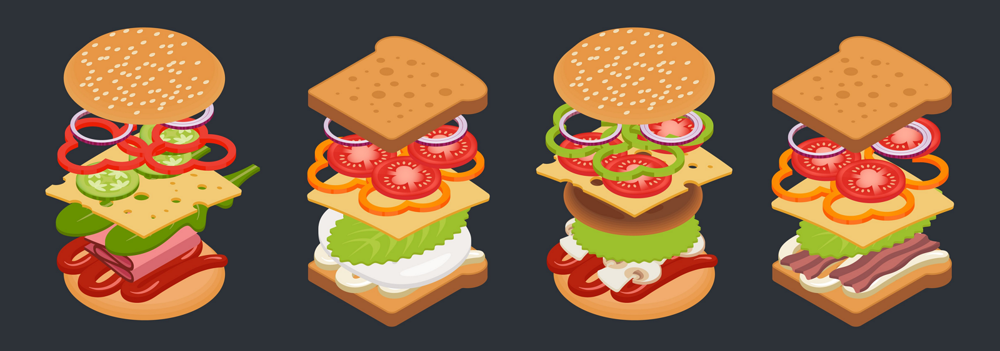
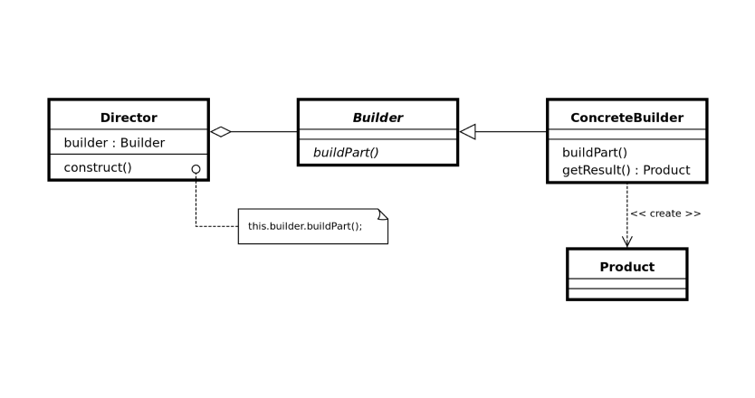

### [↩︎ Main으로 돌아가기](../../README.md)

## Builder Pattern

### 개념

- 복잡한 객체의 생성 과정과 표현 방법을 분리하여 다양한 구성의 인스턴스를 만드는 생성 패턴

- 생성자에 들어갈 매개 변수를 메서드로 하나하나 받아들이고 마지막에 통합 빌드해서 객체를 생성하는 방식

- 예를 들면 수제 햄버거와 같은 느낌

  

### 패턴 구조

