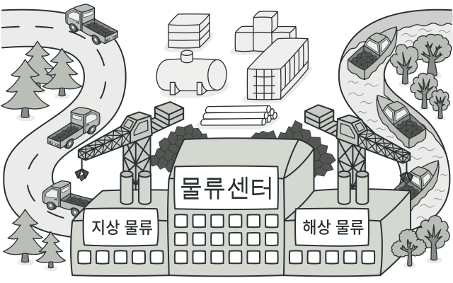
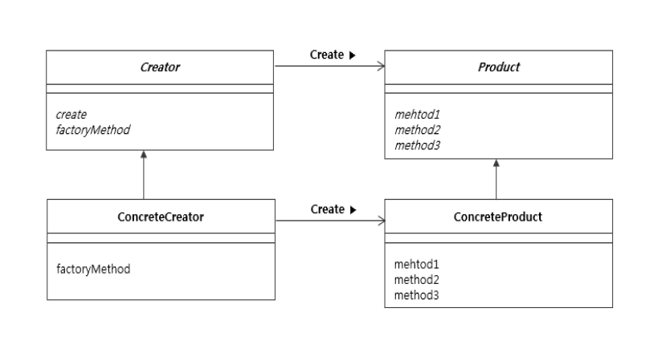

### [↩︎ Main으로 돌아가기](../../README.md)

## Factory Method Pattern

### 개념

- 인스턴스 생성을 하위 클래스에 위임

- 템플릿 메소드 패턴을 변경한 패턴으로, 인스턴스를 만드는 방법은 상위 클래스에서 결정하고, 인스턴스를 실제로 생성하는 일을 하위 클래스에서 결정

- 구체적인 제품 생성을 공장을 통해서 진행

- 팩토리 패턴은 슈퍼 클래스와 여러 개의 서브 클래스가 있는 상황에서 입력값에 따라서 하나의 서브 클래스를 반환하는 상황일 때 주로 사용

- 클라이언트 클래스는 팩토리 클래스에게 인스턴스를 생성하는 책임을 위임

### 패턴 구조

- `Creator`

  - 최상위 공장 클래스로서, 팩토리 메서드를 추상화하여 서브 클래스로 하여금 구현하도록 함

  - `Product` 클래스를 생성하는 추상 클래스

  - `Creator`는 실제 제품을 생성하는 일을 `ConcreteCreator`의 역할에 대해서 아무것도 모름

- `ConcreteCreator`

  - 구체적인 제품을 만드는 클래스

  - 각 서브 공장 클래스들은 이에 맞는 제품 객체를 반환하도록 생성, 추상 메소드를 재정의함

    - 즉, 제품 객체 하나 당, 그에 걸맞는 생산 공장 객체가 위치됨

- `Product`

  - 제품 구현체를 추상화

  - 생성된 제품(인스턴스)이 가지고 있어야 할 인터페이스(API)를 결정하는 추상 클래스

  - 구체적인 역할은 하위 클래스인 `ConcreteProduct`가 결정함

- `ConcreteProduct`

  - 제품 구현체

  - 구체적인 제품을 나타내는 클래스

> [Abstract Factory VS Factory Method](../AbstractVSFactoryMethod/README.md)

### 패턴 예제 (버튼 만들기)

- [예제 코드 보러가기](../AbstractVSFactoryMethod/ButtonExample/)
