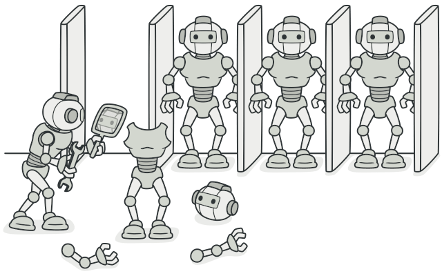
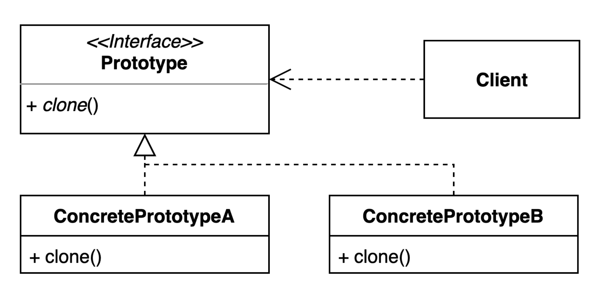

### [↩︎ Main으로 돌아가기](../../README.md)

## Prototype Pattern

### 개념

- 실제 제품을 만들기에 앞서 테스트를 위한 샘플 제품을 만드는데 이때, 샘플 제품을 프로토타입이라고 함

- 객체를 생성하는데 비용이 많이 들고, 비슷한 객체가 이미 있는 경우에 사용되는 생성 패턴 중 하나
  - <u>**즉, 프로토타입 패턴은 원본 객체를 새로운 객체에 복사하여 필요에 따라 수정하는 메커니즘을 제공**</u>

### 패턴 구조

