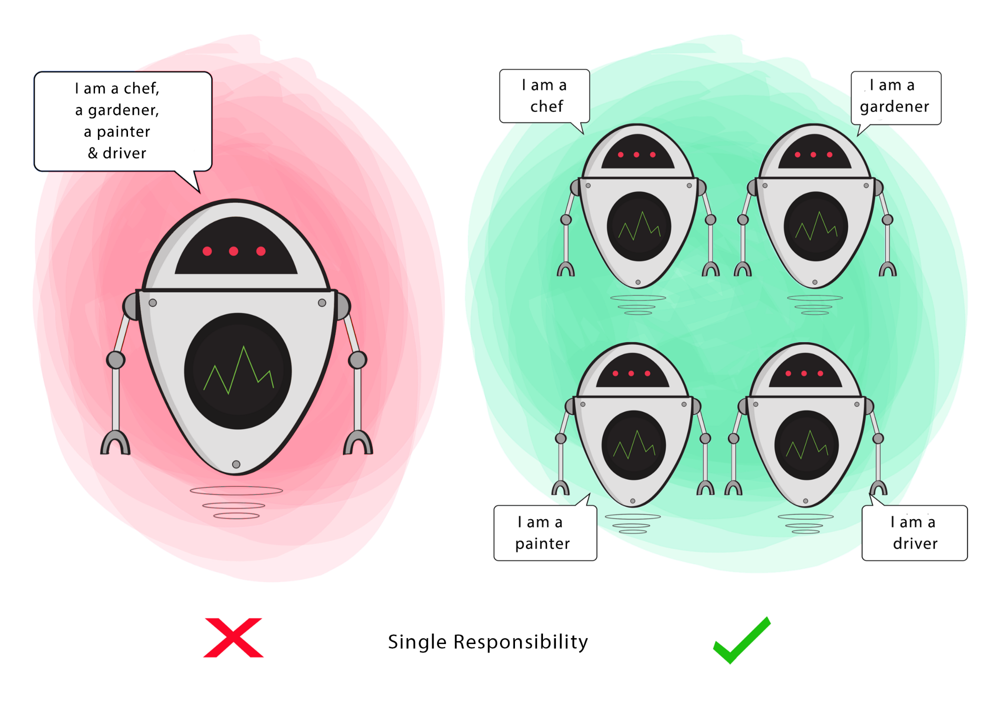
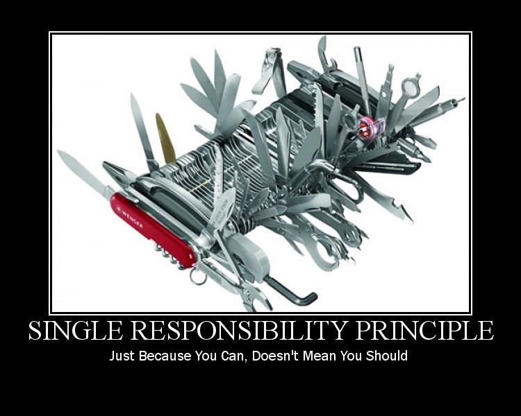

# 객체 지향 설계의 5원칙 `S.O.L.I.D`

## 정의

### `SOLID` 원칙이란?

> 객체 지향 설계에서 지켜줘야 할 5개의 소프트웨어 개발 원칙을 말한다.

- [SRP (Single Responsibility Principle) : 단일 책임 원칙](#단일-책임-원칙---srp-single-responsibility-principle)

- OCP (Open Closed Principle) : 개방 폐쇄 원칙

- LSP (Liskov Substitution Principle) : 리스코프 치환 원칙

- ISP (Interface Segregation Principle) : 인터페이스 분리 원칙

- DIP (Dependeny Inversion Principle) : 의존 역전 원칙

`SOLID` 객체 지향 원칙을 적용함으로써, <b><u>코드를 확장</u></b>하고 <b><u>유지 보수 관리</u></b>하기가 더 쉬워지고,

불필요한 <b><u>복잡성을 제거</u></b>해 리팩토링에 소요되는 시간을 줄임으로써 프로젝트 <b><u>개발의 생산성</u></b>을 높일 수 있음

`SOLID`는 어떠한 특정 프로그래밍 언어 또는 프레임워크를 위해 만들어진 원칙이 아니며,

`SOLID`는 프레임워크도, 라이브러리의 패턴도 아니며, 특정 기술에 국한되지 않기 때문에

`TypeScript` 또는 `Java`와 같은 선호하는 프로그래밍 언어나 프레임워크에 원칙을 자유롭게 적용할 수 있음

> - `SOLID` 원칙을 적용하는 순서가 존재하는가?
>
>   - `SOLID` 원칙의 순서같은 것은 없음
>
> - 프로젝트에 반드시 5가지 원칙을 모두 적용해야 하는가?
>
>   - 프로젝트에 적용할 원칙의 수는 코드의 구성에 따라 다를 수 있으며, 각 원칙은 특정 문제를 해결하기 위한 지침일 뿐이며, 취사 선택해서 잘 사용하면 됨

결론적으로, `SOLID`의 용어의 개념 이론은 <b><u>추상화, 상속, 인터페이스, 다형성... 등 개념들을 재정립</u></b>한 것으로 보면 됨

또한 이 5가지의 원칙들은 서로 독립된 개별적인 개념이 아니라, <b><u>서로 개념적으로 연관</u></b>되어 있음

원칙끼리 서로가 서로를 이용하기도 하고 포함하기도 함

## 각 원칙에 대한 설명

### 단일 책임 원칙 - `SRP (Single Responsibility Principle)`

  
  

> 정리하자면, 용도에 맞는 단 하나의 책임만을 가져야 한다는 원칙

- 단일 책임 원칙은 <b><u>클래스(객체)는 단 하나의 책임만 가져야</u></b>한다는 원칙

  - 여기서의 <b><u>책임</u></b>이라는 의미는 하나의 <b><u>기능 담당</u></b>으로 보면 됨

  - 즉, <b><u>하나의 클래스는 하나의 기능을 담당하여 하나의 책임을 수행</u></b>하는데 집중되도록 클래스를 따로따로 여러 개를 설계하라는 원칙

- 만일, 하나의 클래스에 기능(책임)이 여러 개가 있다면, 기능 변경(수정)이 일어났을 때 수정해야 할 코드가 많아짐

  - 예를 들어, A를 고쳤더니 B를 고쳐야하고, B를 수정하면 또 C를 수정애햐하고, 결국에는 C를 고침으로써 다시 A로 돌아가서 수정해야 하는, 마치 책임이 순환되는 형태가 되어버림

- 최종적으로 단일 책임 원칙의 목적은 <b><u>프로그램의 유지보수성을 높이기 위한</u></b> 설계 기법

  - 이때, <b><u>책임의 범위</u></b>는 딱 정해져있는 것이 아닌, 어떤 프로그램을 개발하느냐에 따라 개발자마다 생각하는 기준이 달라질 수 있으며, 따라서 단일 책임 원칙에는 100% 해답이 없음

  - 예를 들면, 포크락을 포크와 숟가락으로 나누는 사람이 있는 것과 같은 느낌
