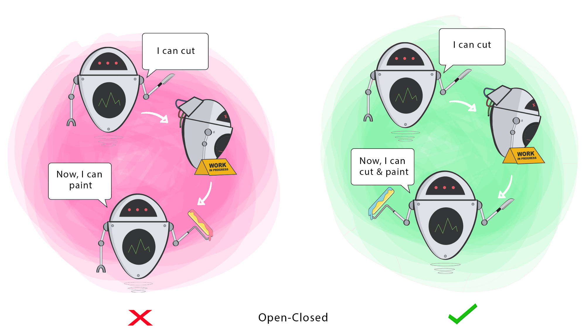
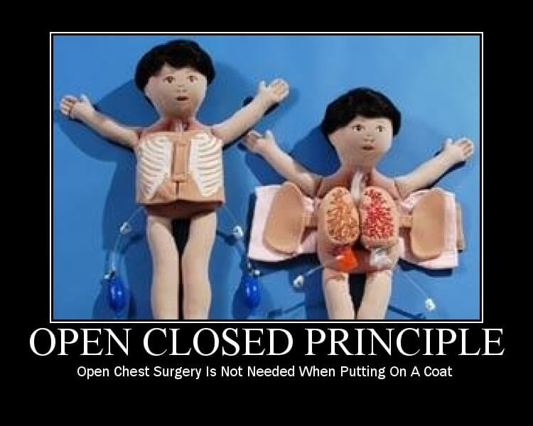
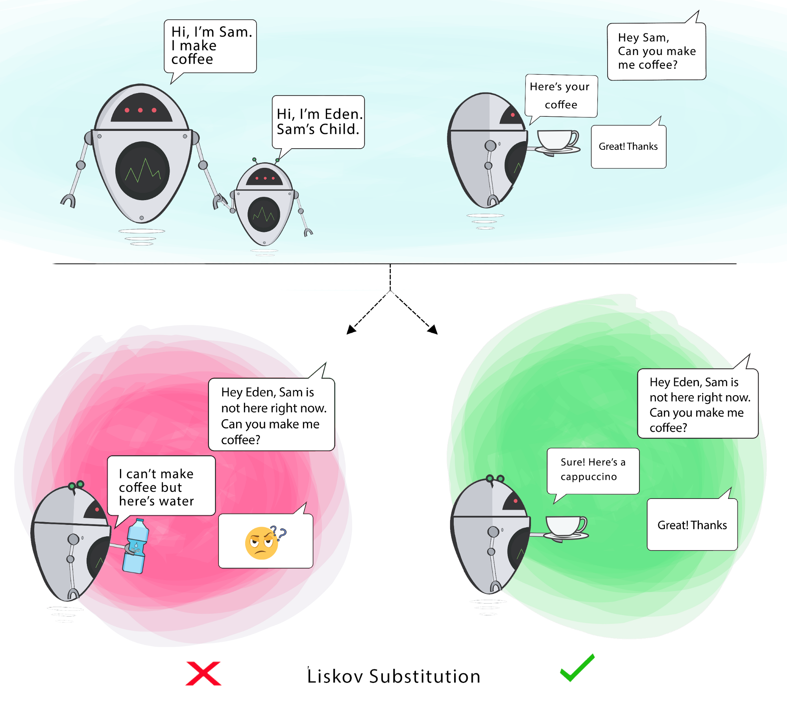
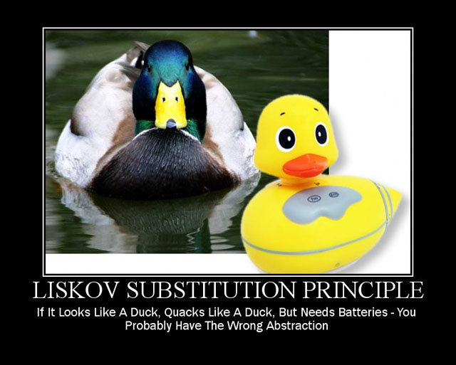
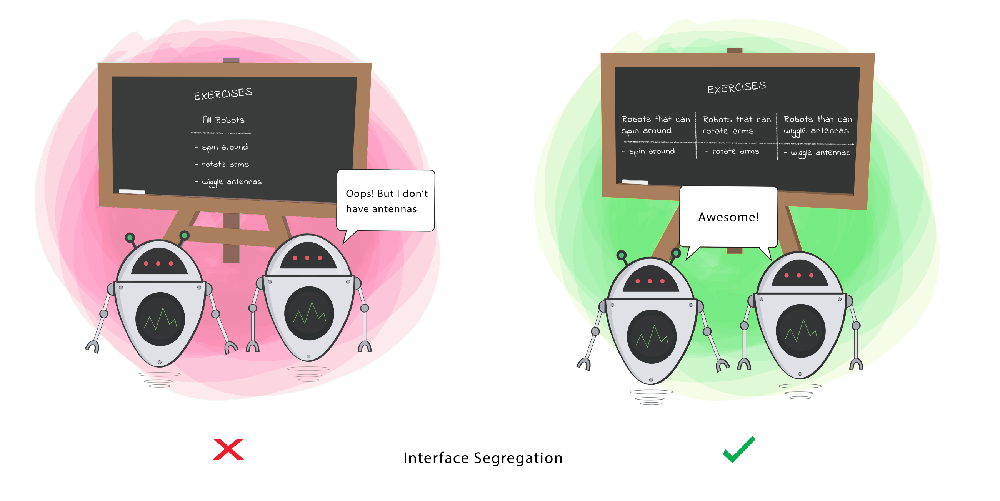
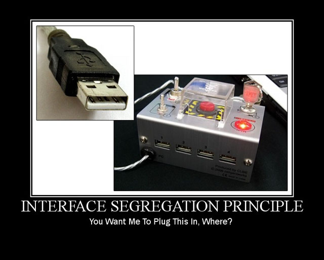
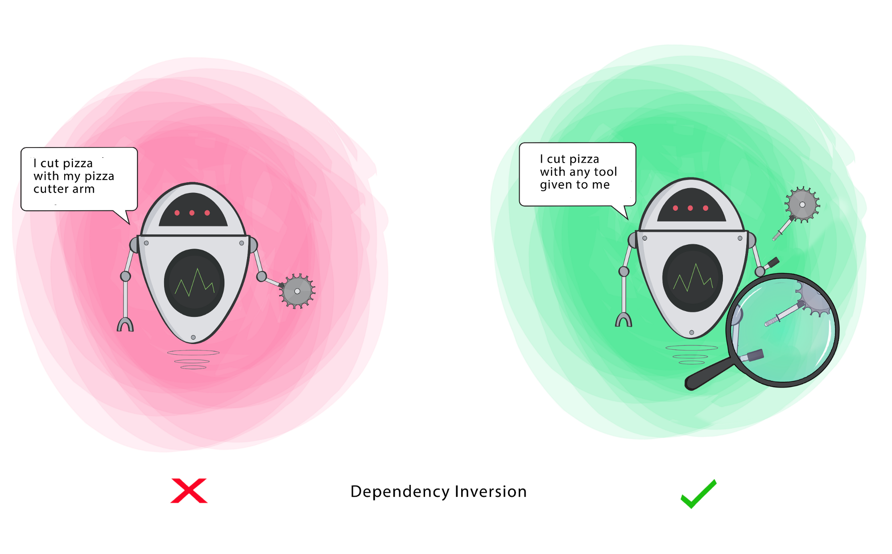
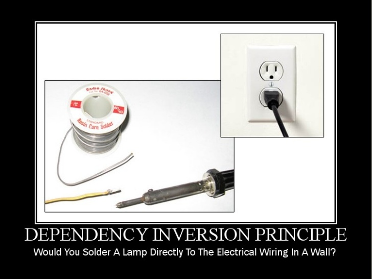

# 객체 지향 설계의 5원칙 `S.O.L.I.D`

## 정의

### `SOLID` 원칙이란?

> 객체 지향 설계에서 지켜줘야 할 5개의 소프트웨어 개발 원칙을 말한다.

- SRP (Single Responsibility Principle) : 단일 책임 원칙 [👇](#단일-책임-원칙---srp-single-responsibility-principle)

- OCP (Open Closed Principle) : 개방 폐쇄 원칙 [👇](#개방-폐쇄-원칙---ocp-open-closed-principle)

- LSP (Liskov Substitution Principle) : 리스코프 치환 원칙 [👇](#리스코프-치환-원칙---lsp-liskov-substitution-principle)

- ISP (Interface Segregation Principle) : 인터페이스 분리 원칙 [👇](#인터페이스-분리-원칙---isp-interface-segregation-principle)

- DIP (Dependeny Inversion Principle) : 의존 역전 원칙 [👇](#의존-역전-원칙---dip-dependeny-inversion-principle)

`SOLID` 객체 지향 원칙을 적용함으로써, <b><u>코드를 확장</u></b>하고 <b><u>유지 보수 관리</u></b>하기가 더 쉬워지고,

불필요한 <b><u>복잡성을 제거</u></b>해 리팩토링에 소요되는 시간을 줄임으로써 프로젝트 <b><u>개발의 생산성</u></b>을 높일 수 있음

`SOLID`는 어떠한 특정 프로그래밍 언어 또는 프레임워크를 위해 만들어진 원칙이 아니며,

`SOLID`는 프레임워크도, 라이브러리의 패턴도 아니며, 특정 기술에 국한되지 않기 때문에

`TypeScript` 또는 `Java`와 같은 선호하는 프로그래밍 언어나 프레임워크에 원칙을 자유롭게 적용할 수 있음

> - `SOLID` 원칙을 적용하는 순서가 존재하는가?
>
>   - `SOLID` 원칙의 순서같은 것은 없음
>
> - 프로젝트에 반드시 5가지 원칙을 모두 적용해야 하는가?
>
>   - 프로젝트에 적용할 원칙의 수는 코드의 구성에 따라 다를 수 있으며, 각 원칙은 특정 문제를 해결하기 위한 지침일 뿐이며, 취사 선택해서 잘 사용하면 됨

결론적으로, `SOLID`의 용어의 개념 이론은 <b><u>추상화, 상속, 인터페이스, 다형성... 등 개념들을 재정립</u></b>한 것으로 보면 됨

또한 이 5가지의 원칙들은 서로 독립된 개별적인 개념이 아니라, <b><u>서로 개념적으로 연관</u></b>되어 있음

원칙끼리 서로가 서로를 이용하기도 하고 포함하기도 함

## 각 원칙에 대한 설명

### 단일 책임 원칙 - `SRP (Single Responsibility Principle)`

  
  

> 정리하자면, 용도에 맞는 단 하나의 책임만을 가져야 한다는 원칙

- 단일 책임 원칙은 <b><u>클래스(객체)는 단 하나의 책임만 가져야</u></b>한다는 원칙

  - 여기서의 <b><u>책임</u></b>이라는 의미는 하나의 <b><u>기능 담당</u></b>으로 보면 됨

  - 즉, <b><u>하나의 클래스는 하나의 기능을 담당하여 하나의 책임을 수행</u></b>하는데 집중되도록 클래스를 따로따로 여러 개를 설계하라는 원칙

- 만일, 하나의 클래스에 기능(책임)이 여러 개가 있다면, 기능 변경(수정)이 일어났을 때 수정해야 할 코드가 많아짐

  - 예를 들어, A를 고쳤더니 B를 고쳐야하고, B를 수정하면 또 C를 수정애햐하고, 결국에는 C를 고침으로써 다시 A로 돌아가서 수정해야 하는, 마치 책임이 순환되는 형태가 되어버림

- 최종적으로 단일 책임 원칙의 목적은 <b><u>프로그램의 유지보수성을 높이기 위한</u></b> 설계 기법

  - 이때, <b><u>책임의 범위</u></b>는 딱 정해져있는 것이 아닌, 어떤 프로그램을 개발하느냐에 따라 개발자마다 생각하는 기준이 달라질 수 있으며, 따라서 단일 책임 원칙에는 100% 해답이 없음

  - 예를 들면, 포크락을 포크와 숟가락으로 나누는 사람이 있는 것과 같은 느낌

### 개방 폐쇄 원칙 - `OCP (Open Closed Principle)`

  
  

> 정리하자면, 확장을 통한 클래스를 손쉽게 구현하면서 확장에 따른 클래스 수정은 최소화한다는 원칙

- 개방 폐쇄 원칙은 클래스는 <b><u>"확장에 열려있어야 하며, 변경에는 닫혀있어야 한다"</u></b>를 뜻함

  - [ 확장에 열려있다. ]

    - 새로운 변경 사항이 발생했을 때, 유연하게 코드를 추가함으로써 큰 힘을 들이지 않고 애플리케이션의 기능을 확장할 수 있음

  - [ 변경에 닫혀있다. ]

    - 새로운 변경 사항이 발생했을 때, 객체의 직접적으로 수정을 제한함

- 쉽게 생각하면, 개방 폐쇄 원칙은 <b><u>추상화 사용을 통한 관계 구축을 권장</u></b>을 의미하는 것

  - 즉, <b><u>다형성과 확장</u></b>을 가능케 하는 객체 지향의 장점을 극대화하는 기본적인 설계 원칙

### 리스코프 치환 원칙 - `LSP (Liskov Substitution Principle)`

  
  

> 정리하자면, 다형성 이용을 위해 부모 타입으로 메서드를 실행해도 의도대로 실행되도록 구성을 해줘야 하는 원칙

- 리스코프 치환 원칙은 <b><u>서브 타입은 언제나 기반(부모) 타입으로 교체</u></b>할 수 있어야 한다는 원칙

  - 쉽게 말하면, 리스코프 치환 원칙은 <b><u>다형성 원리를 이용하기 위한 원칙</u></b> 개념으로 보면 됨

- 간단히 말해 리스코프 치환 원칙이란, <b><u>다형성의 특징을 이용</u></b>하기 위해 상위 클래스 타입으로 객체를 선언하여 하위 클래스의 인스턴스를 받으면, <b><u>업캐스팅된 상태에서 부모의 메서드를 사용해도 동작이 의도대로 흘러가야 하는 것을 의미</u></b>

  - 따라서, 기본적으로 리스코프 치환 원칙은 부모 메서드의 오버라이딩을 조심스럽게 따져가면 해야 함

  - 부모 클래스와 동일한 수준의 선행 조건을 기대하고 사용하는 프로그램 코드에서 예상치 못한 문제를 일으킬 수 있기 때문

### 인터페이스 분리 원칙 - `ISP (Interface Segregation Principle)`

  
  

> 정리하자면, 클라이언트의 목적과 용도에 적합한 인터페이스만을 제공하는 것을 목표로 하는 원칙

- 인터페이스 분리 원칙은 <b><u>인터페이스를 각각 사용에 맞게끔 잘게 분리</u></b>해야한다는 설계 원칙

- 단일 책임 원칙이 <b><u>클래스의 단일 책임</u></b>을 강조한다면, 인터페이스 분리 원칙은 <b><u>인터페이스 분리</u></b>를 통해 설계하는 원칙

  ⚠️ 다만 인터페이스 분리 원칙의 주의해야 할 점은 <b><u>한 번 인터페이스를 분리하여 구성해놓고, 나중에 무언가 수정사항이 생겨서 또 인터페이스들을 분리하는 행위</u></b>를 가하지 말하야 함

  > 인터페이스는 한 번 구성하였으면 왠만해서는 변하면 안되는 정책의 개념으로 들어가야 함

### 의존 역전 원칙 - `DIP (Dependeny Inversion Principle)`

  
  

> 정리하자면, 구현 클래스에 의존하지 말고, <b><u>인터페이스에 의존</u></b>하라는 뜻

- 의존 역전 원칙은 어떤 `Class`를 참조해서 사용해야 하는 상황이 생긴다면, 그 `Class`를 직접 참조하는 것이 아니라, 그 <b><u>대상의 상위 요소(추상 클래스 or 인터페이스)로 참조</u></b>하라는 원칙

  - 의존 관계를 맺을 때 변화하기 쉬운 것 또는 자주 변화하는 것보다는 변화하기 어려운 것, 거의 변화가 없는 것에 의존하라는 것
