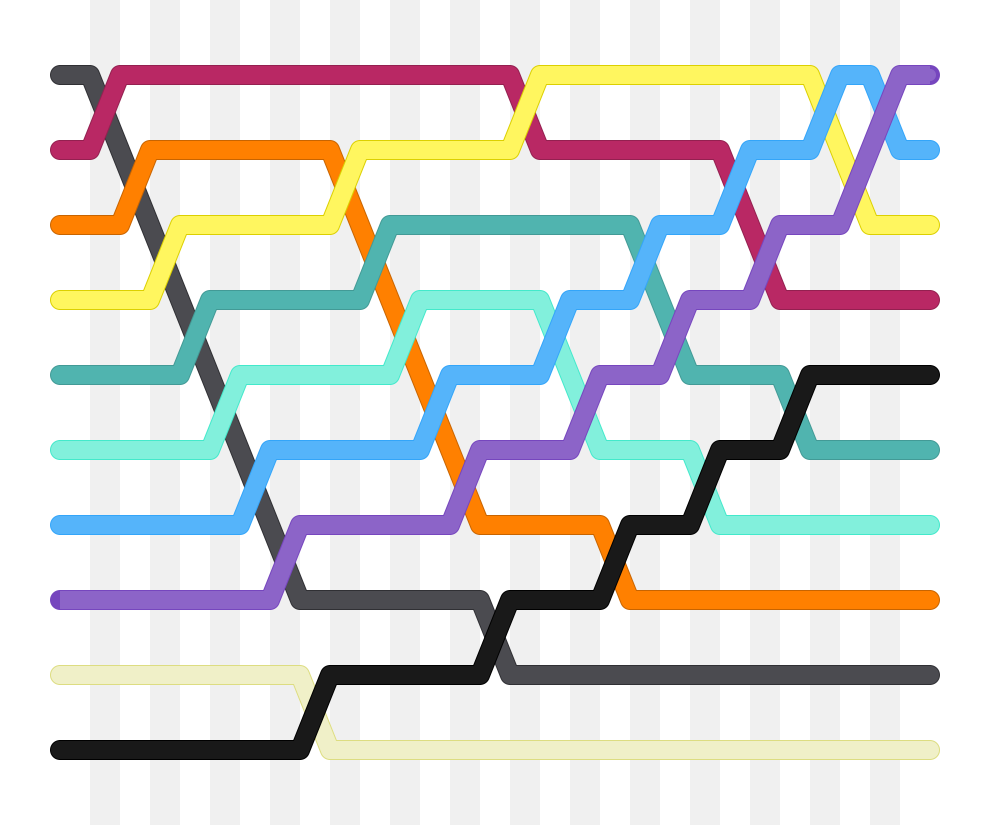
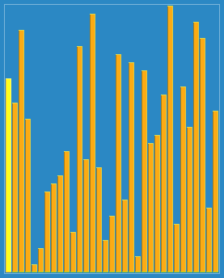
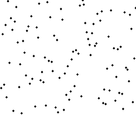

### [↩︎ Main으로 돌아가기](../../README.md)

# Sorting Algorithm

> [정렬 알고리즘 위키](https://ko.wikipedia.org/wiki/%EC%A0%95%EB%A0%AC_%EC%95%8C%EA%B3%A0%EB%A6%AC%EC%A6%98)

## 정렬 방식에 따른 분리

> 컴퓨터 과학 분야에서, 주어진 알고리즘의 <b><u>최선</u></b>, <b><u>최악</u></b> 그리고 <b><u>평균의 경우</u></b>는 각 <b><u>최소</u></b>, <b><u>최대</u></b>, <b><u>평균</u></b> 자원의 사용량을 의미함

### 교환 정렬 ⭐️

- [버블 정렬 `📄 bubble_sort.ts`](./ExchangeSort/bubble_sort.ts)

  <details>
  <summary>정렬 이미지</summary>

    
    

  </details>

- [칵테일(양방향 거품) 정렬 `📄 shaker_sort.ts`](./ExchangeSort/shaker_sort.ts)

  <details>
  <summary>정렬 이미지</summary>

    

  </details>

- [홀짝 정렬 `📄 odd-even_sort.ts`](./ExchangeSort/odd-even_sort.ts)

  <details>
  <summary>정렬 이미지</summary>

    

  </details>

- [빗질 정렬 `📄 comb_sort.ts`](./ExchangeSort/comb_sort.ts)

  <details>
  <summary>정렬 이미지</summary>

    

  </details>

- [난쟁이 정렬 `📄 gnome_sort.ts`](./ExchangeSort/gnome_sort.ts)

  <details>
  <summary>정렬 이미지</summary>

    

  </details>

- [퀵 정렬 `📄 quick_sort.ts`](./ExchangeSort/quick_sort.ts)

  <details>
  <summary>정렬 이미지</summary>

    

  </details>

- [꼭두각시 정렬 `📄 stooge_sort.ts`](./ExchangeSort/stooge_sort.ts) -> 진짜 엄청나게 비효율적

  <details>
  <summary>정렬 이미지</summary>

    

  </details>

- 보고 정렬 -> 그냥 무제한 랜덤 가챠 돌리기...

  <details>
  <summary>의사코드 (마땅한 예제 코드를 짤 수가 없음)</summary>

  ```pseudo
  영어 버전
  while not isInOrder(list):
    shuffle(list)

  --------------------------------

  한글 버전
  (리스트가 배열될 때)까지 실행하기:
    리스트 섞기
  ```

  </details>

  <details>
  <summary>정렬 이미지</summary>

    

  </details>

### 각 알고리즘의 최선, 최악, 그리고 평균의 경우

| 복잡도                                         | 자료 구조 | 최악 시간복잡도                                 | 최선 시간복잡도          | 평균 시간복잡도                            | 공간복잡도  |
| ---------------------------------------------- | --------- | ----------------------------------------------- | ------------------------ | ------------------------------------------ | ----------- |
| [버블 정렬](./ExchangeSort/bubble_sort.ts)     | 배열      | $O(n^2)$ 비교, $O(n^2)$ 교환                    | $O(n)$ 비교, $O(1)$ 교환 | $O(n^2)$ 비교, $O(n^2)$ 교환               | $O(1)$ 보조 |
| [칵테일 정렬](./ExchangeSort/shaker_sort.ts)   | 배열      | $O(n^2)$                                        | $O(n)$                   | $O(n^2)$                                   | $O(1)$      |
| [홀짝 정렬](./ExchangeSort/odd-even_sort.ts)   | 배열      | $O(n^2)$                                        | $O(n)$                   | $O(1)$                                     | -           |
| [빗질 정렬](./ExchangeSort/comb_sort.ts)       | 배열      | $O(n^2)$                                        | $\Theta(n \ log(n))$     | $\Omega(n^2 / 2^p)$ : 여기서 $p$는 증가 수 | $O(1)$      |
| [난쟁이 정렬](./ExchangeSort/gnome_sort.ts)    | 배열      | $O(n^2)$                                        | $O(n)$                   | $O(n^2)$                                   | $O(1)$ 보조 |
| [퀵 정렬](./)                                  | 배열      | $O(n^2)$                                        | $O(n \ log(n))$          | $O(n \ log(n))$                            | $O(1)$      |
| [꼭두각시 정렬](./ExchangeSort/stooge_sort.ts) | 배열      | $O(n$<sup>$log \ 3 / log \ 1.5$</sup>$)$        | -                        | -                                          | $O(n)$      |
| 보고 정렬                                      | 배열      | 무제한 (랜덤화 버전), $O((n+1)!)$ (결정화 버전) | $O(n)$                   | $O((n+1)!)$                                | $O(1)$      |
