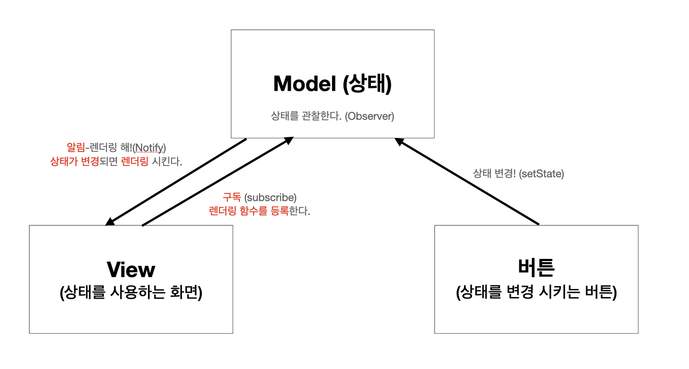
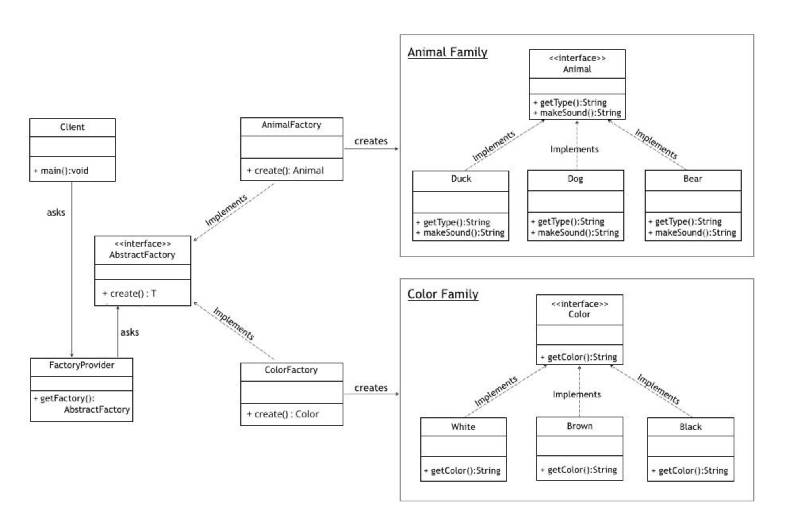

# Design Pattern

> [한글 설명 참고사이트](https://m.hanbit.co.kr/channel/category/category_view.html?cms_code=CMS8616098823)
>
> [JS 버전 디자인 패턴 GitHub](https://github.com/fbeline/design-patterns-JS)

## 디자인 패턴 용도에 따른 분리

| 패턴      | 종류                                                                                                                                                                  | 설명                                                                                                                    |
| --------- | --------------------------------------------------------------------------------------------------------------------------------------------------------------------- | ----------------------------------------------------------------------------------------------------------------------- |
| 생성 패턴 | [싱글턴](#singleton-pattern-행동--생성-패턴), [추상 팩토리](#abstract-character-factory-생성-패턴), 팩토리 메소드, 빌더, 프로토타입                                   | 객체 인스턴스를 생성하는 패턴으로, 클라이언트와 그 클라이언트가 생성해야 하는 객체 인스턴스 사이의 연결을 끊어주는 패턴 |
| 행동 패턴 | 템플릿 메소드, [싱글턴](#singleton-pattern-행동--생성-패턴), 반복자, [옵저버](#observer-pattern-행동-패턴), 상태, 전략, 인터프리터, 역할 변경, 비지터, 중재자, 메멘토 | 클래스와 객체들이 상호작용하는 방법과 역할을 분담하는 방법을 다루는 패턴                                                |
| 구조 패턴 | 데코레이터, 컴포지트, 프록시, 퍼사드, 어댑터, 브리지, 플라이웨이트                                                                                                    | 클래스와 객체를 더 큰 구조로 만들 수 있게 구성을 사용하는 패턴                                                          |

## Observer Pattern (행동 패턴)

### 개념

- 어떤 이벤트가 일어나는 것을 감시하는 패턴을 의미

- 함수로 직접 요청한 적 없지만 시스템에 의해 발생하는 동작들을 이벤트라고 하는데, 이러한 이벤트들을 감시하여 이벤트가 발생할 때마다 미리 정의해 둔 어떠한 동작을 즉각 수행하게 해주는 프로그래밍 패턴

- 옵저버 패턴을 활용하면 다른 객체의 상태 변화를 별도의 함수 호출 없이 즉각적으로 알 수 있기 때문에, 이벤트에 대한 처리를 자주 해야 하는 프로그램이라면 매우 효율적인 프로그램을 작성할 수 있음

### 패턴 이미지

  

## Singleton Pattern (행동 & 생성 패턴)

### 개념

- 생성자가 여러 차례 호출 되더라도 실제로 생성되는 객체는 하나

- 최초 생성 이후에 호출된 생성자는 최초의 생성자가 생성한 객체를 리턴

- 정리하면, 하나의 객체를 여러번 호출하지만, 메모리에 올라가는건 결국 하나
  - 데이터베이스를 연결할 때 많이 사용

### 패턴 이미지

  

## Abstract Character Factory Pattern (생성 패턴)

### 개념

- 연관성있는 객체 군이 여러개 있을 경우 이들을 묶어 추상화하고, 어떤 구체적인 상황이 주어지면 팩토리 객체에서 집합으로 묶은 객체 군을 구현화하는 생성 패턴

- 클라이언트에서 특정 객체를 사용할 때 팩토리 클래스만을 참조하여 특정 객체에 대한 구현부를 감추어 역할과 구현을 분리시킬 수 있음

- 즉, 추상 팩토리 패턴의 핵심은 **제품 "군" 집합**을 타입 별로 찍어낼 수 있다는 점이 포인트

### 패턴 이미지

  

