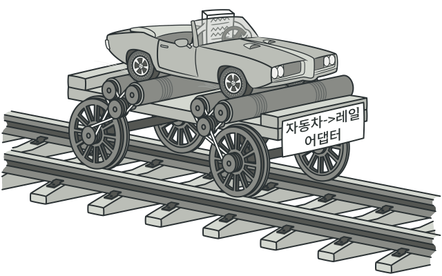
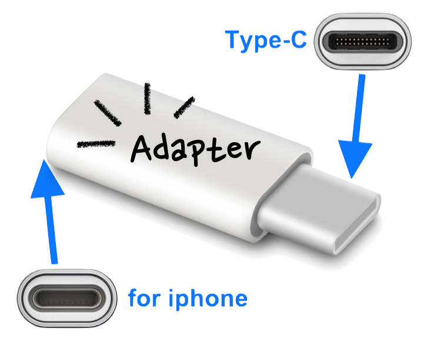
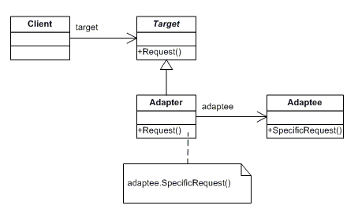
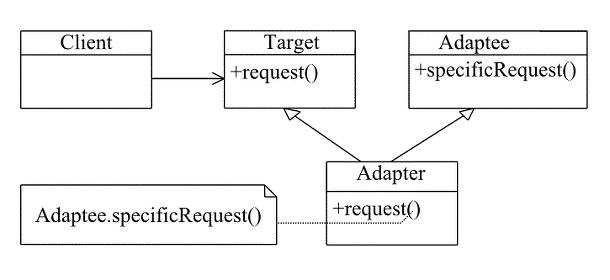

### [🏠 Main으로 돌아가기](../../README.md)

## Adapter Pattern



### 개념



> 위의 사진을 통해 개념을 정리할 수 있음

- 즉, 서로 호환이 되지 않은 단자를 어댑터로 호환시켜 작동시키게끔 하는 것이 어댑터의 역할

- 이를 객체 지향 프로그래밍에 접목해보면, <b><u>호환성이 없는 인터페이스 때문에 함께 동작할 수 없는 클래스들을 함께 작동해주도록 변환</u></b> 역할을 해주는 패턴

  - 예를 들어, 기존에 있는 시스템에 새로운 써드파티 라이브러리를 추가하고 싶거나, Legacy 인터페이스를 새로운 인터페이스로 교체하는 경우에 어댑터 패턴을 사용하면 코드의 재사용성을 높일 수 있음

- 정리하자면, 이미 구축되어 있는 것을 새로운 어떤 것에 사용할 때 양 쪽 간의 호환성을 유지해주기 위해 사용하는 것으로
  기존 시스템에서 새로운 업체에서 제공하는 기능을 하용하려고 할 때 서로 간의 인터페이스를 어댑터로 일치시켜줌으로써
  <b><u>호환성 및 신규 기능 확장</u></b>을 할 수 있다고 보면 됨

### 패턴 구조

> 어댑터 패턴에는 기존 시스템의 클래스를 상속(Inheritance)해서 호환 작업을 해주냐,
>
> 합성(Composition)해서 호환 작업을 해주냐에 따라 두 가지 패턴 방법으로 나뉨

#### Object Adapter (합성)

- 합성(Composition)된 멤버에게 위임을 이용한 어댑터 패턴 (⭐️)

  - 자기가 해야 할 일을 클래스 멤버 객체의 메소드에게 다시 시킴으로써 목적을 달성하는 것을 위임이라고 함

- 합성을 활용했기 때문에 런타임 중에 `Adaptee(Service)`가 결정되어 유연함

- `Adaptee(Service)` 객체를 필드 변수로 저장해야 하기 때문에 공간 차지 비용이 듦



- `Adaptee(Service)`

  - 어댑터 대상 객체 (기존 시스템 / 외부 시스템 / 써드파티 라이브러리)

- `Target(Client Interface)`

  - `Adapter`가 구현한 인터페이스

- `Adapter`

  - `Client`와 `Adaptee(Service)` 중간에서 호환성이 없는 둘을 연결시켜주는 역할을 담당

  - <b><u>`Object Adapter` 방식에서는 합성을 이용해 구성</u></b>

  - <b><u>`Adaptee(Service)`를 따로 클래스 멤버로 설정하고 위임을 통해 동작을 매치시킴</u></b>

- `Client`

  - 기존 시스템을 어댑터를 통해 이용하려는 쪽

    - `Target(Client Interface)`를 통해 `Adaptee(Service)`를 이용할 수 있음

<details>
  <summary>adapter_object.ts</summary>

```TS
  // Adaptee
  // 클라이언트에서 사용하고 싶은 기존의 서비스 (하지만 호환이 안되서 바로 사용이 불가능)
  class ServiceObject {
    specificMethod(specialData: number | string): void {
      console.log("기존 서비스 기능 호출 + " + specialData);
    }
  }

  // Client Interface
  // 클라이언트가 접근해서 사용할 고수준의 어댑터 모듈
  interface TargetObject {
    method(data: number | string): void;
  }

  // Adapter
  // Adaptee 서비스를 클라이언트에서 사용하게 할 수 있도록 호환 처리 해주는 어댑터
  class AdapterObject implements TargetObject {
    adaptee: ServiceObject; // Composition으로 Service 객체를 클래스 필드로

    constructor(adaptee: ServiceObject) {
      this.adaptee = adaptee;
    }

    // 어댑터가 인스턴스화되면 호환시킬 기존 서비스를 설정
    AdapterObject(adaptee: ServiceObject) {
      this.adaptee = adaptee;
    }

    // 어댑터의 메소드가 호출되면, Adaptee의 메소드를 호출하도록
    method(data: number | string): void {
      this.adaptee.specificMethod(data); // 위임
    }
  }

  class ClientObject {
    // static
    // 클래스를 통해 인스턴스를 생성할 필요 없이 클래스의 속성 또는 메서드를 사용할때 사용하는 정의 키워드
    public static main(data: number | string, _args?: string[]): void {
      // 1. 어댑터 생성 (기존 서비스를 인자로 받아 호환 작업 처리)
      const adapter = new AdapterObject(new ServiceObject());

      // 2. Client Interface(Target)의 스펙에 따라 메소드를 실행하면 기존 서비스의 메소드가 실행
      adapter.method(data);
    }
  }

  ClientObject.main("새로운 메소드 호출");
  // 기존 서비스 기능 호출 + 새로운 메소드 호출
```

</details>

#### Class Adapter (상속)

- 클래스 상속을 이용한 어댑터 패턴

- `Adaptee(Service)`를 상속했기 때문에 따로 객체 구현없이 바로 코드 재사용이 가능

- 상속은 대표적으로 기존에 구현된 코드를 재사용하는 방식이지만, Java에서는 다중 상속 불가 문제 때문에 전반적으로 권장히자 않는 방법

  - JavaScript도 마찬가지로 다중 상속이 불가능하지만, 믹스인(Mixins) 방식을 통한 클래스 정의로 다중 상속이 가능



- `Adaptee(Service)`

  - 어댑터 대상 객체 (기존 시스템 / 외부 시스템 / 써드파티 라이브러리)

- `Target(Client Interface)`

  - `Adapter`가 구현한 인터페이스

- `Adapter`

  - `Client`와 `Adaptee(Service)` 중간에서 호환성이 없는 둘을 연결시켜주는 역할을 담당

  - <b><u>`Class Adapter` 방식에서는 상속을 이용해 구성</u></b>

  - <b><u>`Existing Class`와 `Adaptee(Service)`를 동시에 `implements`, `extends`하여 구현</u></b>

- `Client`

  - 기존 시스템을 어댑터를 통해 이용하려는 쪽

    - `Target(Client Interface)`를 통해 `Adaptee(Service)`를 이용할 수 있음

<details>
  <summary>adapter_class.ts</summary>

```TS
  // Adaptee
  // 클라이언트에서 사용하고 싶은 기존의 서비스 (하지만 호환이 안되서 바로 사용이 불가능)
  class ServiceClass {
    specificMethod(specialData: number | string): void {
      console.log("기존 서비스 기능 호출 + " + specialData);
    }
  }

  // Client Interface
  // 클라이언트가 접근해서 사용할 고수준의 어댑터 모듈
  interface TargetClass {
    method(data: number | string): void;
  }

  // Adapter
  // Adaptee 서비스를 클라이언트에서 사용하게 할 수 있도록 호환 처리 해주는 어댑터
  class AdapterClass extends ServiceClass implements TargetClass {
    // 어댑터의 메소드가 호출되면, 부모 클래스 Adaptee의 메소드 호출
    method(data: number | string): void {
      this.specificMethod(data);
    }
  }

  class ClientClass {
    public static main(data: number | string, _args?: string[]) {
      // 1. 어댑터 생성
      const adapter = new AdapterClass();

      // 2. 인터페이스의 스펙에 따라 메소드를 실행하면 기존 서비스의 메소드가 실행
      adapter.method(data);
    }
  }

  ClientClass.main("새로운 메소드 호출");
  // 기존 서비스 기능 호출 + 새로운 메소드 호출
```

</details>
