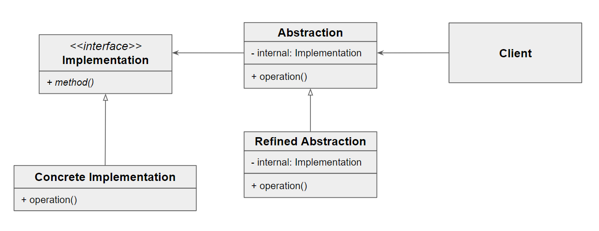

### [↩︎ Main으로 돌아가기](../../README.md)

## Bridge Pattern

### 개념

> 간단하게 실제 다리를 생각하면 됨 (기능 클래스 계층 ||===== Bridge =====|| 구현 클래스 계층)
>
> 강에 다리를 놓음으로써 강 양쪽의 두 장소를 연결하는 것과 같이 기능 클래스 계층과 구현 클래스 계층을 잇는 다리의 역할을 하는 패턴
>
> 
>
> - feat. Tower Bridge (London)

- 객체의 구현부와 추상적인 부분을 분리하여 각각을 독립적으로 변형할 수 있게 하는 디자인 패턴 중 하나

- 브릿지 패턴을 사용하면 추상화와 구현을 분리하여 클래스 간의 결합도를 낮출 수 있으며, 이는 코드의 재사용성과 유연성을 높일 수 있게 해줌

- 개발에서 주로 사용 가능한 경우

  - 데이터베이스 연동

  - 네트워크 통신

  - 플러그인 시스템

  - UI 개발

  - 하드웨어 연동

### 패턴 구조

- `Abstraction`

  - 기능 계층의 최상위 클래스

    - 추상화된 인터페이스를 제공하며, 이 인터페이스는 구현에 의존하지 않음

- `RefindeAbstraction`

  - 기능 계층에서 새로운 부분을 확장한 클래스

    - 추상화된 인터페이스를 확장

- `Implementor`

  - `Abstraction`의 기능을 구현하기 위한 인터페이스의 정의

    - 구현 인터페이스를 정의

- `ConcreteImplementor`

  - 실제 기능을 구현

    - 구현 인터페이스를 실제로 구현
