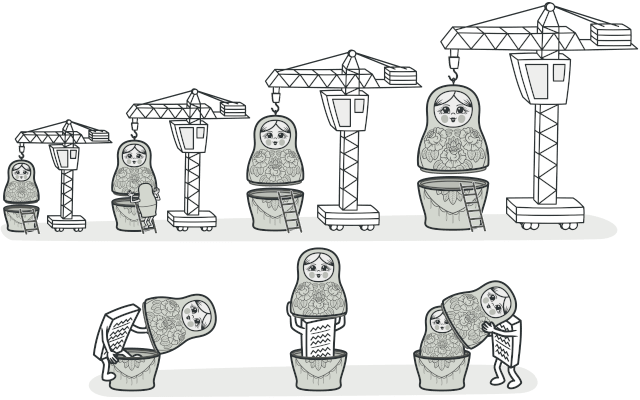

### [↩︎ Main으로 돌아가기](../../README.md)

## Decorator Pattern

### 개념

- 대상 객체에 대한 기능 확장이나 변경이 필요할 때, 객체의 결합을 통해 서브클래싱 대신 쓸 수 있는 유연한 대안 구조 패턴

- `decorator`를 해석하자면 '장식자'라는 의미를 가지고 있는데, 마치 기본 제품에 포장지나 외부 디자인을 살짝 변경해 줌으로써 새로운 기능을 부여하는 것과 같다고 보면 됨

- 데코레이터 패턴을 이용하면 필요한 추가 기능의 조합을 런타임에서 동적으로 생성할 수 있음

  - 데코레이터할 대상 객체를 새로운 행동들을 포함한 특수 장식자 객체에 넣어서 행동들을 해당 장식자 객체마다 연결시켜 서브 클래스로 구성할 때보다 훨씬 유연하게 기능을 확장할 수 있음

### 패턴 구조

- `Component` (`Interface`)

  - 원본 객체와 장식된 객체 모두를 묶는 역할

- `ConcreteComponent`

  - 원본 객체 (데코레이팅 할 객체)

- `Decorator`

  - 추상화된 장식자 클래스

- `ConcreteDecorator`

  - 구체적인 장식자 클래스

    - 부모 클래스가 감싸고 있는 하나의 `Component`를 호출하면서 호출 전/후로 부가적인 로직을 추가할 수 있음

> 데코레이터 순서는 원본 대상 객체 생성자를 장식자 생성자가 래핑(`wrapping`)하는 형태로 간다고 보면 됨
>
> ex) `new 장식자(new 원본())`
