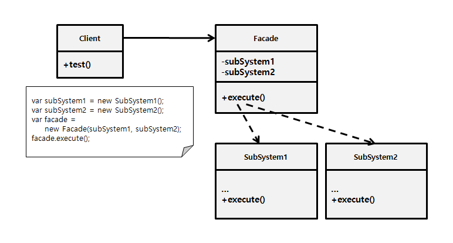

### [↩︎ Main으로 돌아가기](../../README.md)

## Facade Pattern

### 개념

- 사용하기 복잡한 클래스 라이브러리에 대해 사용하기 편하게 간편한 인터페이스(`API`)를 구성하기 위한 구조 패턴

  - 예를 들면, <b><u>교제를 보고 필기노트에 재정리를 하듯이 클래스를 재정리하는 행위</u></b>로 보면 됨

- 프로그램이 업데이트를 하면서 버전이 올라갈수록 많은 클래스들이 만들어져 점점 복잡해지는 상황에 놓이게 되는데,
  이러한 거대한 솔루션을 구성하려면 상호 관련된 많은 클래스들을 적절히 제어해야 할 필요성이 있으며,
  이때 이 처리를 개별적으로 제어하는 것이 아닌 일종의 '창구'를 준비하여 중계할 수 있도록 구성하는 과정

  

  고객은 복잡한 절차 지식없이 고객센터(창구)에 요구만 하면 결과를 얻음

- 정리하면, 퍼사드 패턴은 복잡하게 얽혀있는 것을 정리해서 사용하기 편한 인터페이스를 고객에게 제공한다고 보면 되며,
  고객은 복잡한 시스템을 알 필요없이 시스템의 외부에 대해서 단순한 인터페이스를 이용하기만 하면 됨

### 패턴 구조

  

- `Facade`

  - `SubSystem` 기능을 편리하게 사용할 수 있도록 하기 위해 여러 시스템과 상호 작용하는 복잡한 로직을 재정리해서 높은 레벨의 인터페이스를 구성

  - `Facade` 역할은 `SubSystem`의 많은 역할에 대해 '단순한 창구'가 됨

  - `Client`와 `SubSystem`이 서로 긴밀하게 연결되지 않도록 함

  - 반드시 한 개만 존재해야 한다는 규칙은 없으며, 연관되지 않은 기능이 있다면 얼마든지 `Facade`를 별도로 분리해서 사용할 수 있음

    - 다른 `Facade`에서 사용할 수도 있으며, `Client`에서 직접 접근도 가능

- `SubSystem`

  - 수십 가지의 라이브러리 혹은 클래스들

- `Client`

  - `SubSystem`에 직접 접근하는 대신 `Facade`를 사용
