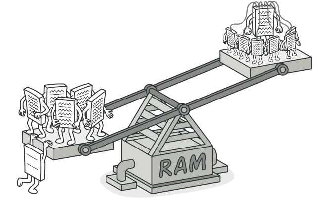
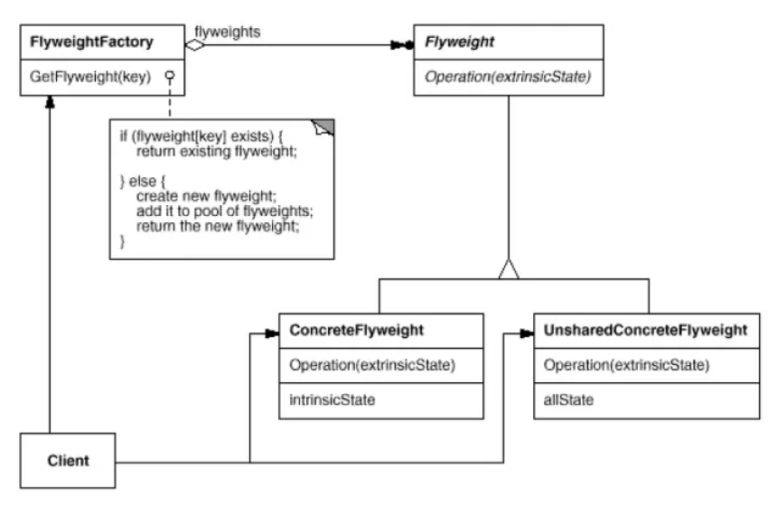

### [🏠 Main으로 돌아가기](../../README.md)

## Flyweight Pattern

### 개념

- 재사용 가능한 객체 인스턴스를 공유시켜 메모리 사용량을 최소화하는 패턴

- 간단히 말하면 캐시(`Cache`) 개념을 코드로 패턴화 한 것

  - 자주 변화하는 속성(extrinsic)과 변화하지 않는 속성(intrinsic)을 분리하고 변하지 않는 속성을 캐시하여 재사용해 메모리 사용을 줄이는 방식

  - 그래서 동일하거나 유사한 객체들 사이에 가능한 많은 데이터를 서로 공유하여 사용하도록 하여 최적화를 노리는 경량 패턴이라고도 불림

  > `Intrinsic` & `Extrinsic`
  >
  > - `Intrinsic` (<b><u>공유할 수 있는 객체</u></b>)
  >
  >   - "고유한, 본질적인"이라는 의미를 가지며, 본직적인 상태란 인스턴스가 어떠한 상황에서도 변하지 않는 정보를 말함
  >
  >   - 그래서 값이 고정되어 있기에 충분히 언제 어디서 공유해도 문제가 없음
  >
  > - `Extrinsic` (<b><u>공유할 수 없는 객체</u></b>)
  >
  >   - "외적인, 비본질적인"이라는 의미를 가지며, 인스턴스를 두는 장소나 상황에 따라서 변화하는 정보를 말함
  >
  >   - 그래서 값이 언제 어디서 변화할지 모르기 때문에 이를 캐시해서 공유할 수 없음

- 객체를 일일히 생성한 것과 객체를 공유 상태로 만든 것에 대한 메모리 무게 차이

### 패턴 구조

- `Flyweight`

  - 경량 객체를 묶는 인터페이스

- `ConcreteFlyweight`

  - 공유 가능한 재사용되는 객체 (intrinsic state) -> 변화하지 않는 속성

- `UnsharedConcreteFlyweight`

  - 공유 불가능한 객체 (extrinsic state) -> 자주 변화하는 속성

- `FlyweightFactory`

  - 경량 객체를 만드는 공장 역할과 캐시 역할을 겸비하는 `Flyweight` 객체 관리 클래스

  - `GetFlyweight()` 메서드는 팩토리 메서드 역할을 한다고 보면 됨

  - 만일 객체가 메모리에 존재하면 그대로 가져와 반환(캐싱)하고, 없다면 새로 생성해 반환

- `Client`

  - `Client`는 `FlyweightFactory`를 통해 `Flyweight` 타입의 객체를 얻어 사용
