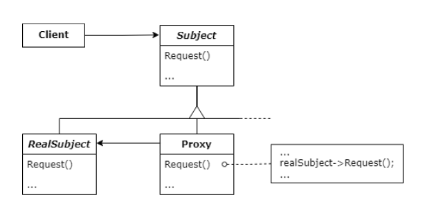

### [↩︎ Main으로 돌아가기](../../README.md)

## Proxy Pattern

### 개념

- 대상 원본 객체를 대리하여 대신 처리하게 함으로써 로직의 흐름을 제어하는 패턴

- 프록시(`Proxy`)의 사전적인 의미는 대리인이라는 뜻으로, 누군가에게 어떤 일을 대신 시키는 것을 의미

  - 이를 객체 지향 프로그래밍에 접목해보면 클라이언트가 대상 객체를 직접 쓰는게 아니라 중간에 프록시(대리인)을 거쳐서 쓰는 코드 패턴이라고 보면 됨

- 대상 객체(`Subject`)의 메소드를 직접 실행하는 것이 아닌, 대상 객체에 접근하기 전에 프록시(`Proxy`) 객체의 메서드를 접근한 후 추가적인 로직을 처리한 뒤 접근하는 방식

- 굳이 이런 번거로운 방식을 취하는 이유는 대상 클래스가 민감한 정보를 가지고 있거나 인스턴스화 하기에 무겁거나 추가 기능을 가미하고 싶은데 <b><u>원본 객체를 수정할 수 없는 상황일 때를 극복</u></b>하기 위해서 사용

### 프록시 패턴의 특징

- 보안 (`Sercurity`)

  - 프록시는 클라이언트가 작업을 수행할 수 있는 권한이 있는지 확인하고 검사 결과가 긍정적인 경우에만 요청을 대상으로 전달

- 캐싱 (`Caching`)

  - 프록시가 내부 캐시를 유지하여 데이터가 캐시에 아직 존재하지 않는 경우에만 대상에서 작업이 실행되도록 함

- 데이터 유효성 검사 (`Data validation`)

  - 프록시가 입력 대상으로 전달하기 전에 유효성 검사 진행

- 지연 초기화 (`Lazy initialization`)

  - 대상의 생성 비용이 비싸다면, 프록시는 그것을 필요로 할 때까지 연기할 수 있음

- 로깅 (`Logging`)

  - 프록시는 메소드 호출과 상대 매개 변수를 인터셉트하고 이를 기록

- 원격 객체 (`Remote object`)

  - 프록시는 원격 위치에 있는 객체를 가져와서 로컬처럼 보이게 할 수 있음

### 패턴 구조

  

### 프록시 패턴 종류
