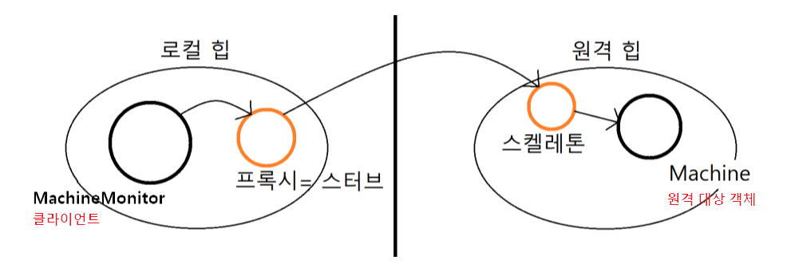
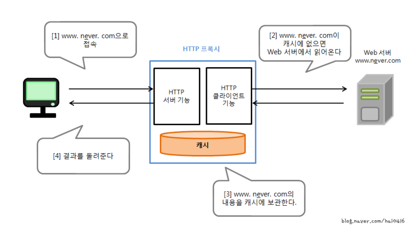

### [↩︎ Main으로 돌아가기](../../README.md)

## Proxy Pattern

### 개념

- 대상 원본 객체를 대리하여 대신 처리하게 함으로써 로직의 흐름을 제어하는 패턴

- 프록시(`Proxy`)의 사전적인 의미는 대리인이라는 뜻으로, 누군가에게 어떤 일을 대신 시키는 것을 의미

  - 이를 객체 지향 프로그래밍에 접목해보면 클라이언트가 대상 객체를 직접 쓰는게 아니라 중간에 프록시(대리인)을 거쳐서 쓰는 코드 패턴이라고 보면 됨

- 대상 객체(`Subject`)의 메소드를 직접 실행하는 것이 아닌, 대상 객체에 접근하기 전에 프록시(`Proxy`) 객체의 메서드를 접근한 후 추가적인 로직을 처리한 뒤 접근하는 방식

- 굳이 이런 번거로운 방식을 취하는 이유는 대상 클래스가 민감한 정보를 가지고 있거나 인스턴스화 하기에 무겁거나 추가 기능을 가미하고 싶은데 <b><u>원본 객체를 수정할 수 없는 상황일 때를 극복</u></b>하기 위해서 사용

### 패턴 특징

- 보안 (`Sercurity`)

  - 프록시는 클라이언트가 작업을 수행할 수 있는 권한이 있는지 확인하고 검사 결과가 긍정적인 경우에만 요청을 대상으로 전달

- 캐싱 (`Caching`)

  - 프록시가 내부 캐시를 유지하여 데이터가 캐시에 아직 존재하지 않는 경우에만 대상에서 작업이 실행되도록 함

- 데이터 유효성 검사 (`Data validation`)

  - 프록시가 입력 대상으로 전달하기 전에 유효성 검사 진행

- 지연 초기화 (`Lazy initialization`)

  - 대상의 생성 비용이 비싸다면, 프록시는 그것을 필요로 할 때까지 연기할 수 있음

- 로깅 (`Logging`)

  - 프록시는 메소드 호출과 상대 매개 변수를 인터셉트하고 이를 기록

- 원격 객체 (`Remote object`)

  - 프록시는 원격 위치에 있는 객체를 가져와서 로컬처럼 보이게 할 수 있음

### 패턴 구조

<div align="center">
  
</div>

- `Subject`

  - `Proxy`와 `RealSubject`를 하나로 묶는 인터페이스 (다형성)

  - 대상 객체와 프록시 역할을 동일하게 하는 추상 메소드 `operation()`를 정의

  - 인터페이스가 있기 때문에 `Client`는 `Proxy` 역할과 `RealSubject` 역할의 차이를 의식할 필요가 없음

- `RealSubject`

  - 원본 대상 객체

- `Proxy`

  - `RealSubject`를 중계할 대리자 역할

  - 프록시는 대상 객체(`RealSubject`)를 합성(`composition`)

  - 프록시는 대상 객체(`RealSubject`)와 같은 이름의 메서드를 호출하며, 별도의 로직을 수행할 수 있음 (인터페이스 구현 메소드)

  - 프록시는 흐름 제어만 할 뿐, 결과 값을 조작하거나 변경시키면 X

- `Client`

  - `Subject` 인터페이스를 이용하여 프록시 객체를 생성해 이용

  - 클라이언트는 `Proxy`를 중간에 두고 `Proxy`를 통해서 `RealSubject`와 데이터를 주고 받음

### 패턴 종류

> `Proxy` 패턴은 단순하면서도 자주 쓰이는 패턴이며, 다양한 활용 방식이 존재
>
> 같은 `Proxy` 객체라도 어떠한 로직을 짜느냐에 따라 그 활용도는 천차만별
>
> `Proxy` 패턴의 기본형을 어떤 방식으로 변형하느냐에 따라 종류가 나뉘어짐
>
> 해당 목차의 예제는 Java 코드 기반의 예제를 TypeScript로 변경하여 코드를 작성함

#### Default Interface & Class

<details>
  <summary>default_config.ts</summary>

```TS
  export interface ISubject {
    action(): void;
  }

  export class RealSubject implements ISubject {
    action(): void {
      console.log("원본 객체 액션");
    }
  }
```

</details>

#### 기본형 프록시 (`Normal Proxy`)

<details>
  <summary>proxy_normal.ts</summary>

```TS
  class Proxy implements ISubject {
    private subject: RealSubject; // 대상 객체를 composition

    constructor(subject: RealSubject) {
      this.subject = subject;
    }

    action(): void {
      this.subject.action(); // 위임
      console.log("프록시 객체 액션 (Normal Proxy)");
    }
  }

  class Client {
    public main(_args?: string[]): void {
      const sub = new Proxy(new RealSubject());
      sub.action();
    }
  }

  const client_code = new Client();
  client_code.main();

  // 원본 객체 액션
  // 프록시 객체 액션 (Normal Proxy)
```

</details>

#### 가상 프록시 (`Virtual Proxy`)

- 지연 초기화 방식

- 가끔 필요하지만 항상 메모리에 적재되어 있는 무거운 서비스 객체가 있는 경우

- 이 구현은 실제 객채의 생성에 많은 자원이 소모되지만 사용 빈도는 낮을 때 쓰는 방식

- 서비스가 시작될 때 객체를 생성하는 대신에 개체 초기화가 실제로 필요한 시점에 초기화될 수 있도록 지연할 수 있음

<details>
  <summary>proxy_virtual.ts</summary>

```TS
  class Proxy implements ISubject {
    private subject!: RealSubject;
    // has no initializer and is not definitely assigned in the constructor 에러 방지

    action(): void {
      // 프록시 객체는 실제 요청(action(메소드 호출))이 들어 왔을 때 실제 객체를 생성한다.
      if (!this.subject) {
        this.subject = new RealSubject();
      }

      this.subject.action(); // 위임
      console.log("프록시 객체 액션 (Virtual Proxy)");
    }
  }

  class Client {
    public main(_args?: string[]): void {
      const sub = new Proxy();
      sub.action();
    }
  }

  const client_code = new Client();
  client_code.main();

  // 원본 객체 액션
  // 프록시 객체 액션 (Virtual Proxy)
```

</details>

#### 보호 프록시 (`Protection Proxy`)

- 프록시가 대상 객체에 대한 자원으로의 엑세스 제어 (접근 권한)

- 특정 클라이언트만 서비스 객체를 사용할 수 있도록 하는 경우

- 프록시 객체를 통해 클라이언트의 자격 증명이 기준과 일치하는 경우에만 서비스 객체에 요청을 전달할 수 있게 함

<details>
  <summary>proxy_protection.ts</summary>

```TS
  class Proxy implements ISubject {
    private subject: RealSubject; // 대상 객체를 composition
    access: boolean; // 접근 권한

    constructor(subject: RealSubject, access: boolean) {
      this.subject = subject;
      this.access = access;
    }

    action(): void {
      if (this.access) {
        this.subject.action(); // 위임
        console.log("access -> true");
        console.log("프록시 객체 액션 (Protecion Proxy)");
      } else {
        console.log("access -> false");
        console.log("프록시 객체 액션 거부 (Protecion Proxy)");
      }
    }
  }

  class Client {
    public main(access: boolean, _args?: string[]): void {
      const sub = new Proxy(new RealSubject(), access);
      sub.action();
    }
  }

  const access_true = true;
  const client_true = new Client();
  client_true.main(access_true);
  console.log("");

  // 원본 객체 액션
  // access -> true
  // 프록시 객체 액션 (Protecion Proxy)

  const access_false = false;
  const client_false = new Client();
  client_false.main(access_false);
  console.log("");

  // access -> false
  // 프록시 객체 액션 거부 (Protecion Proxy)
```

</details>

#### 로깅 프록시 (`Logging Proxy`)

- 대상 객체에 대한 로깅을 추가하려는 경우

- 프록시는 서비스 메서드를 실행하고 전달하기 전에 로깅을 하는 기능을 추가하여 재정의

<details>
  <summary>proxy_logging.ts</summary>

```TS
  class Proxy implements ISubject {
    private subject: RealSubject; // 대상 객체를 composition

    constructor(subject: RealSubject) {
      this.subject = subject;
    }

    action(): void {
      console.log("로깅...............");
      this.subject.action(); // 위임
      console.log("프록시 객체 액션 (Logging Proxy)");
      console.log("로깅...............");
    }
  }

  class Client {
    public main(_args?: string[]): void {
      const sub = new Proxy(new RealSubject());
      sub.action();
    }
  }

  const client_true = new Client();
  client_true.main();

  // 로깅...............
  // 원본 객체 액션
  // 프록시 객체 액션 (Logging Proxy)
  // 로깅...............
```

</details>

#### 원격 프록시 (`Remote Proxy`)

- 프록시 클래스는 로컬에 있고, 대상 객체는 원격 서버에 존재하는 경우

- 프록시 객체는 네트워크를 통해 클라이언트의 요청을 전달하여 네트워크와 관련된 불필요한 작업들을 처리하고 결과값만 반환

- 클라이언트 입장에선 프록시를 통해 객체를 이용하는 것이니 원격이든 로컬이든 신경 쓸 필요가 없으며, 프록시는 진짜 객체와 통신을 대리함

> 프록시를 스터드라고도 부르며, 프록시로부터 전달된 명령을 이해하고 적합한 메소드를 호출해주는 역할을 하는 보조객체를 스켈레톤이라고 함



#### 캐싱 프록시 (`Caching Proxy`)

- 데이터가 큰 경우, 캐싱하여 재사용을 유도

- 클라이언트 요청의 결과를 캐시하고 이 캐시의 수명 주기를 관리

- `HTTP Proxy`

  `HTTP Proxy`는 웹 서버와 브라우저 가이에서 웹 페이지의 캐싱을 실행하는 소프트웨어이다.

  웹 브라우저가 어떤 웹 페이지를 표시랗 때 직접 웹 서버에서 그 페이지를 가져오는 것이 아니고, `HTTP Proxy`가 캐시해서 어떤 페이지를 대신해서 취득한다.

  만일 최신 정보가 필요하거나 페이지의 유효기간이 지났을 때, 웹 서버에 웹 페이지를 가지러 간다.

  이를 패턴으로 따져보면, 웹 브라우저가 `Client` 역할, `HTTP Proxy`가 `Proxy` 역할, 그리고 웹 서버가 `RealSubject` 역할을 한다고 보면 된다.

  
